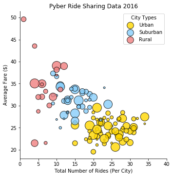

```python
# Dependencies
import matplotlib.pyplot as plt
import numpy as np
import pandas as pd
import seaborn as sns
```


```python
# Load in csvs
city = "Resources/city_data.csv"
city_df = pd.read_csv(city)
print(city_df.head())

ride = "Resources/ride_data.csv"
ride_df = pd.read_csv(ride)
ride_df.head()
```

                 city  driver_count   type
    0      Kelseyland            63  Urban
    1      Nguyenbury             8  Urban
    2    East Douglas            12  Urban
    3   West Dawnfurt            34  Urban
    4  Rodriguezburgh            52  Urban
    


<div>
<style>
    .dataframe thead tr:only-child th {
        text-align: right;
    }

    .dataframe thead th {
        text-align: left;
    }

    .dataframe tbody tr th {
        vertical-align: top;
    }
</style>
<table border="1" class="dataframe">
  <thead>
    <tr style="text-align: right;">
      <th></th>
      <th>city</th>
      <th>date</th>
      <th>fare</th>
      <th>ride_id</th>
    </tr>
  </thead>
  <tbody>
    <tr>
      <th>0</th>
      <td>Sarabury</td>
      <td>2016-01-16 13:49:27</td>
      <td>38.35</td>
      <td>5403689035038</td>
    </tr>
    <tr>
      <th>1</th>
      <td>South Roy</td>
      <td>2016-01-02 18:42:34</td>
      <td>17.49</td>
      <td>4036272335942</td>
    </tr>
    <tr>
      <th>2</th>
      <td>Wiseborough</td>
      <td>2016-01-21 17:35:29</td>
      <td>44.18</td>
      <td>3645042422587</td>
    </tr>
    <tr>
      <th>3</th>
      <td>Spencertown</td>
      <td>2016-07-31 14:53:22</td>
      <td>6.87</td>
      <td>2242596575892</td>
    </tr>
    <tr>
      <th>4</th>
      <td>Nguyenbury</td>
      <td>2016-07-09 04:42:44</td>
      <td>6.28</td>
      <td>1543057793673</td>
    </tr>
  </tbody>
</table>
</div>


```python
#merge the two df on "city keeping everything
combi_df = pd.merge(ride_df, city_df, on="city", how="outer")
combi_df.head()
```


<div>
<style>
    .dataframe thead tr:only-child th {
        text-align: right;
    }

    .dataframe thead th {
        text-align: left;
    }

    .dataframe tbody tr th {
        vertical-align: top;
    }
</style>
<table border="1" class="dataframe">
  <thead>
    <tr style="text-align: right;">
      <th></th>
      <th>city</th>
      <th>date</th>
      <th>fare</th>
      <th>ride_id</th>
      <th>driver_count</th>
      <th>type</th>
    </tr>
  </thead>
  <tbody>
    <tr>
      <th>0</th>
      <td>Sarabury</td>
      <td>2016-01-16 13:49:27</td>
      <td>38.35</td>
      <td>5403689035038</td>
      <td>46</td>
      <td>Urban</td>
    </tr>
    <tr>
      <th>1</th>
      <td>Sarabury</td>
      <td>2016-07-23 07:42:44</td>
      <td>21.76</td>
      <td>7546681945283</td>
      <td>46</td>
      <td>Urban</td>
    </tr>
    <tr>
      <th>2</th>
      <td>Sarabury</td>
      <td>2016-04-02 04:32:25</td>
      <td>38.03</td>
      <td>4932495851866</td>
      <td>46</td>
      <td>Urban</td>
    </tr>
    <tr>
      <th>3</th>
      <td>Sarabury</td>
      <td>2016-06-23 05:03:41</td>
      <td>26.82</td>
      <td>6711035373406</td>
      <td>46</td>
      <td>Urban</td>
    </tr>
    <tr>
      <th>4</th>
      <td>Sarabury</td>
      <td>2016-09-30 12:48:34</td>
      <td>30.30</td>
      <td>6388737278232</td>
      <td>46</td>
      <td>Urban</td>
    </tr>
  </tbody>
</table>
</div>


```python
'''Per City: Average Fare, Total Rides, Total Drivers, City Type'''

#group by city and type
city_grp = combi_df.groupby(['city', 'type'])

#find the average fare per city
city_avg_fare = city_grp['fare'].mean()

#total rides per city
city_rides = city_grp['ride_id'].count()

#total drivers per city (mean is used because all the numbers are the same)
city_drivers = city_grp['driver_count'].mean()

#make the df
bubble_df = pd.DataFrame({"Average Fare ($)": city_avg_fare, 
                          "Total Number of Rides (Per City)": city_rides, 
                          "Driver Count": city_drivers})

#make the type index a column
bubble_df = bubble_df.reset_index(level='type')

#rename the type column
bubble_df = bubble_df.rename(columns={"type": "City Types"})

bubble_df.head()
```


<div>
<style>
    .dataframe thead tr:only-child th {
        text-align: right;
    }

    .dataframe thead th {
        text-align: left;
    }

    .dataframe tbody tr th {
        vertical-align: top;
    }
</style>
<table border="1" class="dataframe">
  <thead>
    <tr style="text-align: right;">
      <th></th>
      <th>City Types</th>
      <th>Average Fare ($)</th>
      <th>Driver Count</th>
      <th>Total Number of Rides (Per City)</th>
    </tr>
    <tr>
      <th>city</th>
      <th></th>
      <th></th>
      <th></th>
      <th></th>
    </tr>
  </thead>
  <tbody>
    <tr>
      <th>Alvarezhaven</th>
      <td>Urban</td>
      <td>23.928710</td>
      <td>21</td>
      <td>31</td>
    </tr>
    <tr>
      <th>Alyssaberg</th>
      <td>Urban</td>
      <td>20.609615</td>
      <td>67</td>
      <td>26</td>
    </tr>
    <tr>
      <th>Anitamouth</th>
      <td>Suburban</td>
      <td>37.315556</td>
      <td>16</td>
      <td>9</td>
    </tr>
    <tr>
      <th>Antoniomouth</th>
      <td>Urban</td>
      <td>23.625000</td>
      <td>21</td>
      <td>22</td>
    </tr>
    <tr>
      <th>Aprilchester</th>
      <td>Urban</td>
      <td>21.981579</td>
      <td>49</td>
      <td>19</td>
    </tr>
  </tbody>
</table>
</div>


```python
'''Make the bubble plot showing the relationship b/t the 4 key variables'''

#make a list containing Pyber's color scheme: gold, light sky blue, light coral
pyber_colors = ['#FFD700', '#87CEFA', '#F08080']

#make the plot
sns.lmplot(x='Total Number of Rides (Per City)', y='Average Fare ($)', data=bubble_df, fit_reg=False, 
           scatter_kws={'s':(bubble_df['Driver Count'] * 5),  'linewidths':1,'edgecolor':'k'}, 
           legend_out=False, palette=pyber_colors, hue='City Types')

#set the x axis limit
plt.xlim(0, 40)

#set the title
plt.title('Pyber Ride Sharing Data 2016')

plt.show()

```




