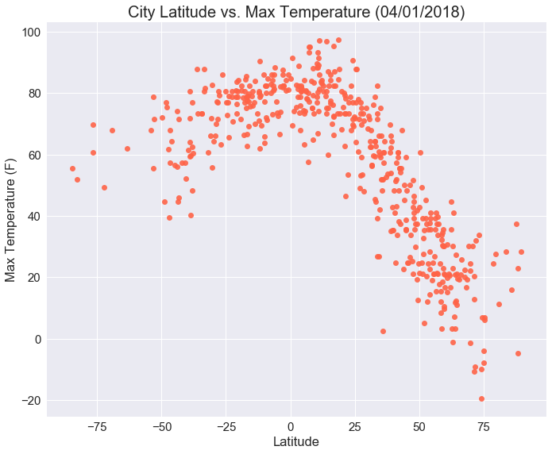
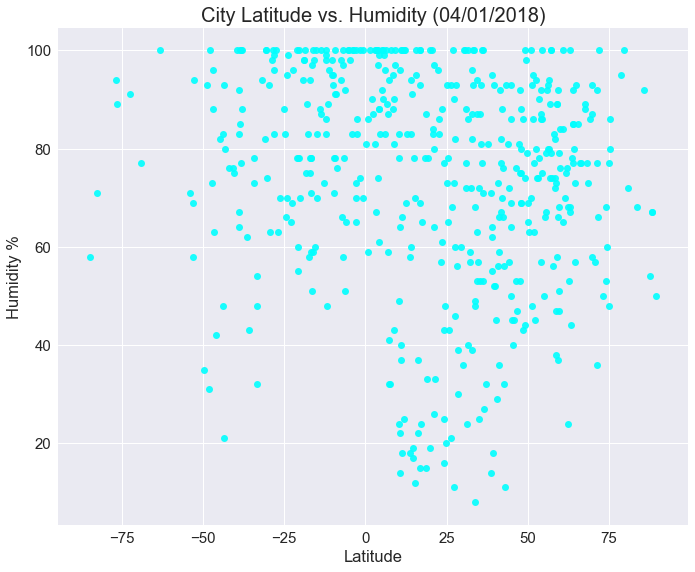
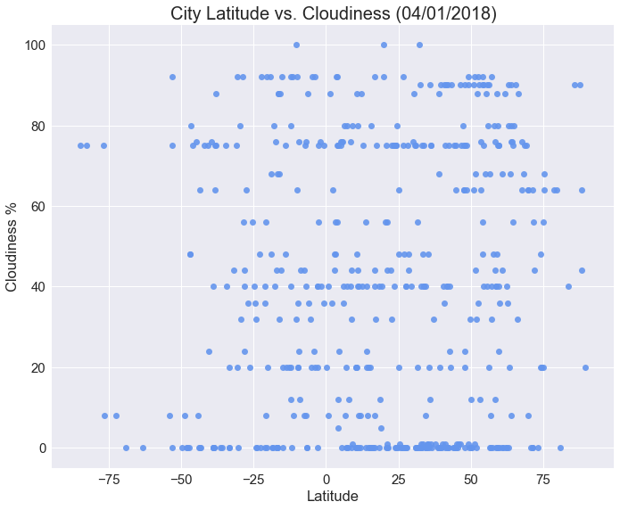
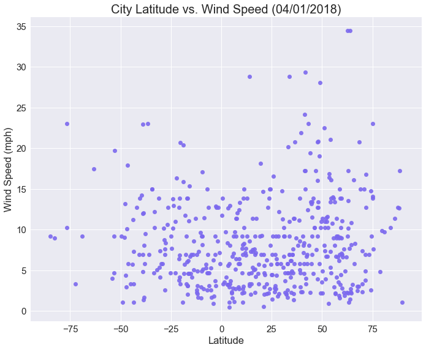

## WeatherPy
------
### Objective
Build a series of scatter plots to showcase the following relationships:
* Temperature (F) vs. Latitude
* Humidity (%) vs. Latitude
* Cloudiness (%) vs. Latitude
* Wind Speed (mph) vs. Latitude

### Method
* Randomly select at least 500 unique (non-repeat) cities based on latitude and longitude
* Perform a weather check on each of the cities using a series of successive API calls
* Include a print log of each city as it's being processed with the city number, city name, and requested URL
* Save both a CSV of all data retrieved and png images for each scatter plot

### Analysis
* From the latitude vs temperature plot you can see that it is hotter near the equator. Also noteworthy--the temperatures are much cooler in the positive latitudes due to the season. Winter has just finished north of the equator (positive latitudes) and summer has just ended south of the equator (negative latitudes). 


* There does not seem to be a relationship between latitude and humidity, cloudiness, or windspeed.


* While this is a representative model of weather in cities across the world, it is only a snapshot of one day's weather. A yearly or even longer historical view could offer more insight. 


```python
# Dependencies
import random
import pandas as pd
import matplotlib.pyplot as plt
import openweathermapy.core as owm
import seaborn as sns

from citipy import citipy
from urllib.error import HTTPError
from urllib.parse import quote_plus
from datetime import datetime
from config import owkey
```


```python
'''Generate cities list'''

#make lists for lat and lng
lat = []
lng = []

#get random #s for lat and lng and append to their lists
for i in range(2500):
    #use randrange + random rather than uniform b/c the full range of 
    # lattitudes and longitudes should be covered
    lat.append(random.randrange(-90, 90) + random.random())
    lng.append(random.randrange(-180, 180) + random.random())

#make a df
df = pd.DataFrame({'Latitude': lat, 'Longitude': lng, 'Place': ''})
    
#find the nearest city using citipy and add to the df
for index, row in df.iterrows():
    city = citipy.nearest_city(row['Latitude'], row['Longitude'])
    df.at[index,"Place"] = (f"{city.city_name},{city.country_code}")

#drop any duplicate cities
df = df.drop_duplicates(['Place'], keep='first')

#reset the index
df = df.reset_index(drop=True)
```


```python
'''Perform API calls'''

#**NOTE: replace "YOUROWNAPIKEY" with your own api key in the URL. I left mine out because we were 
# told in class not to put on github**

#make a setting dict
settings = {"units": "imperial", "appid": owkey}

#make a list containing the info needed
keys = ['main.temp_max', 'main.humidity', 'clouds.all', 'wind.speed', 'name', 'sys.country']

#make the "done" print statement
done = f"""{'-'*30}
Data Retrieval Complete
{'-'*30}"""

#find the current weather for each place and add data to the df
#**NOTE: I didn't include date because it's not used for anything. If I were to include it,
# 'dt' goes in the keys dictionary and would follow the additions below
for index, row in df.iterrows():
    try:
        place = row['Place']
        data = owm.get_current(place, **settings)
        info = data(*keys)
        df.at[index,'Max Temperature (F)'] = (info[0])
        df.at[index,'Humidity %'] = (int(info[1]))
        df.at[index,'Cloudiness %'] = (info[2])
        df.at[index,'Wind Speed (mph)'] = (info[3])
        df.at[index,'City'] = (info[4])
        df.at[index,'Country'] = (info[5])
        print(f"Processing Record {index} | {place}")
        print(f"{owm.BASE_URL}weather?units=Imperial&APPID=YOUROWNAPIKEY&q={quote_plus(place)}")
    except(HTTPError):
        print(f"Processing Record {index} | {place}")
        print(f"Missing field/result for {row['Place']}. Skipping.")
print(done)
```

    Processing Record 0 | albany,au
    http://api.openweathermap.org/data/2.5/weather?units=Imperial&APPID=YOUROWNAPIKEY&q=albany%2Cau
    Processing Record 1 | hobart,au
    http://api.openweathermap.org/data/2.5/weather?units=Imperial&APPID=YOUROWNAPIKEY&q=hobart%2Cau
    Processing Record 2 | pandamatenga,bw
    http://api.openweathermap.org/data/2.5/weather?units=Imperial&APPID=YOUROWNAPIKEY&q=pandamatenga%2Cbw
    Processing Record 3 | east london,za
    http://api.openweathermap.org/data/2.5/weather?units=Imperial&APPID=YOUROWNAPIKEY&q=east+london%2Cza
    Processing Record 4 | inhambane,mz
    http://api.openweathermap.org/data/2.5/weather?units=Imperial&APPID=YOUROWNAPIKEY&q=inhambane%2Cmz
    Processing Record 5 | busselton,au
    http://api.openweathermap.org/data/2.5/weather?units=Imperial&APPID=YOUROWNAPIKEY&q=busselton%2Cau
    Processing Record 6 | new norfolk,au
    http://api.openweathermap.org/data/2.5/weather?units=Imperial&APPID=YOUROWNAPIKEY&q=new+norfolk%2Cau
    Processing Record 7 | thompson,ca
    http://api.openweathermap.org/data/2.5/weather?units=Imperial&APPID=YOUROWNAPIKEY&q=thompson%2Cca
    Processing Record 8 | vardo,no
    http://api.openweathermap.org/data/2.5/weather?units=Imperial&APPID=YOUROWNAPIKEY&q=vardo%2Cno
    Processing Record 9 | mullaitivu,lk
    Missing field/result for mullaitivu,lk. Skipping.
    Processing Record 10 | barrow,us
    http://api.openweathermap.org/data/2.5/weather?units=Imperial&APPID=YOUROWNAPIKEY&q=barrow%2Cus
    Processing Record 11 | avarua,ck
    http://api.openweathermap.org/data/2.5/weather?units=Imperial&APPID=YOUROWNAPIKEY&q=avarua%2Cck
    Processing Record 12 | cape town,za
    http://api.openweathermap.org/data/2.5/weather?units=Imperial&APPID=YOUROWNAPIKEY&q=cape+town%2Cza
    Processing Record 13 | senmonorom,kh
    Missing field/result for senmonorom,kh. Skipping.
    Processing Record 14 | eldikan,ru
    Missing field/result for eldikan,ru. Skipping.
    Processing Record 15 | hermanus,za
    http://api.openweathermap.org/data/2.5/weather?units=Imperial&APPID=YOUROWNAPIKEY&q=hermanus%2Cza
    Processing Record 16 | rikitea,pf
    http://api.openweathermap.org/data/2.5/weather?units=Imperial&APPID=YOUROWNAPIKEY&q=rikitea%2Cpf
    Processing Record 17 | hithadhoo,mv
    http://api.openweathermap.org/data/2.5/weather?units=Imperial&APPID=YOUROWNAPIKEY&q=hithadhoo%2Cmv
    Processing Record 18 | hasaki,jp
    http://api.openweathermap.org/data/2.5/weather?units=Imperial&APPID=YOUROWNAPIKEY&q=hasaki%2Cjp
    Processing Record 19 | taolanaro,mg
    Missing field/result for taolanaro,mg. Skipping.
    Processing Record 20 | cabo san lucas,mx
    http://api.openweathermap.org/data/2.5/weather?units=Imperial&APPID=YOUROWNAPIKEY&q=cabo+san+lucas%2Cmx
    Processing Record 21 | igurubi,tz
    http://api.openweathermap.org/data/2.5/weather?units=Imperial&APPID=YOUROWNAPIKEY&q=igurubi%2Ctz
    Processing Record 22 | ushuaia,ar
    http://api.openweathermap.org/data/2.5/weather?units=Imperial&APPID=YOUROWNAPIKEY&q=ushuaia%2Car
    Processing Record 23 | camacha,pt
    http://api.openweathermap.org/data/2.5/weather?units=Imperial&APPID=YOUROWNAPIKEY&q=camacha%2Cpt
    Processing Record 24 | arraial do cabo,br
    http://api.openweathermap.org/data/2.5/weather?units=Imperial&APPID=YOUROWNAPIKEY&q=arraial+do+cabo%2Cbr
    Processing Record 25 | hilo,us
    http://api.openweathermap.org/data/2.5/weather?units=Imperial&APPID=YOUROWNAPIKEY&q=hilo%2Cus
    Processing Record 26 | dingle,ie
    http://api.openweathermap.org/data/2.5/weather?units=Imperial&APPID=YOUROWNAPIKEY&q=dingle%2Cie
    Processing Record 27 | tezu,in
    http://api.openweathermap.org/data/2.5/weather?units=Imperial&APPID=YOUROWNAPIKEY&q=tezu%2Cin
    Processing Record 28 | vaini,to
    http://api.openweathermap.org/data/2.5/weather?units=Imperial&APPID=YOUROWNAPIKEY&q=vaini%2Cto
    Processing Record 29 | brainerd,us
    http://api.openweathermap.org/data/2.5/weather?units=Imperial&APPID=YOUROWNAPIKEY&q=brainerd%2Cus
    Processing Record 30 | lebu,cl
    http://api.openweathermap.org/data/2.5/weather?units=Imperial&APPID=YOUROWNAPIKEY&q=lebu%2Ccl
    Processing Record 31 | tazmalt,dz
    http://api.openweathermap.org/data/2.5/weather?units=Imperial&APPID=YOUROWNAPIKEY&q=tazmalt%2Cdz
    Processing Record 32 | fairbanks,us
    http://api.openweathermap.org/data/2.5/weather?units=Imperial&APPID=YOUROWNAPIKEY&q=fairbanks%2Cus
    Processing Record 33 | umm lajj,sa
    http://api.openweathermap.org/data/2.5/weather?units=Imperial&APPID=YOUROWNAPIKEY&q=umm+lajj%2Csa
    Processing Record 34 | sao felipe,br
    Missing field/result for sao felipe,br. Skipping.
    Processing Record 35 | attawapiskat,ca
    Missing field/result for attawapiskat,ca. Skipping.
    Processing Record 36 | dudinka,ru
    http://api.openweathermap.org/data/2.5/weather?units=Imperial&APPID=YOUROWNAPIKEY&q=dudinka%2Cru
    Processing Record 37 | airai,pw
    Missing field/result for airai,pw. Skipping.
    Processing Record 38 | torbay,ca
    http://api.openweathermap.org/data/2.5/weather?units=Imperial&APPID=YOUROWNAPIKEY&q=torbay%2Cca
    Processing Record 39 | chokurdakh,ru
    http://api.openweathermap.org/data/2.5/weather?units=Imperial&APPID=YOUROWNAPIKEY&q=chokurdakh%2Cru
    Processing Record 40 | norman wells,ca
    http://api.openweathermap.org/data/2.5/weather?units=Imperial&APPID=YOUROWNAPIKEY&q=norman+wells%2Cca
    Processing Record 41 | tuktoyaktuk,ca
    http://api.openweathermap.org/data/2.5/weather?units=Imperial&APPID=YOUROWNAPIKEY&q=tuktoyaktuk%2Cca
    Processing Record 42 | mataura,pf
    Missing field/result for mataura,pf. Skipping.
    Processing Record 43 | saint-philippe,re
    http://api.openweathermap.org/data/2.5/weather?units=Imperial&APPID=YOUROWNAPIKEY&q=saint-philippe%2Cre
    Processing Record 44 | tiksi,ru
    http://api.openweathermap.org/data/2.5/weather?units=Imperial&APPID=YOUROWNAPIKEY&q=tiksi%2Cru
    Processing Record 45 | goderich,sl
    Missing field/result for goderich,sl. Skipping.
    Processing Record 46 | buraydah,sa
    http://api.openweathermap.org/data/2.5/weather?units=Imperial&APPID=YOUROWNAPIKEY&q=buraydah%2Csa
    Processing Record 47 | pevek,ru
    http://api.openweathermap.org/data/2.5/weather?units=Imperial&APPID=YOUROWNAPIKEY&q=pevek%2Cru
    Processing Record 48 | znamenskoye,ru
    http://api.openweathermap.org/data/2.5/weather?units=Imperial&APPID=YOUROWNAPIKEY&q=znamenskoye%2Cru
    Processing Record 49 | vila franca do campo,pt
    http://api.openweathermap.org/data/2.5/weather?units=Imperial&APPID=YOUROWNAPIKEY&q=vila+franca+do+campo%2Cpt
    Processing Record 50 | bredasdorp,za
    http://api.openweathermap.org/data/2.5/weather?units=Imperial&APPID=YOUROWNAPIKEY&q=bredasdorp%2Cza
    Processing Record 51 | sao lourenco do sul,br
    http://api.openweathermap.org/data/2.5/weather?units=Imperial&APPID=YOUROWNAPIKEY&q=sao+lourenco+do+sul%2Cbr
    Processing Record 52 | kalmunai,lk
    http://api.openweathermap.org/data/2.5/weather?units=Imperial&APPID=YOUROWNAPIKEY&q=kalmunai%2Clk
    Processing Record 53 | tsihombe,mg
    Missing field/result for tsihombe,mg. Skipping.
    Processing Record 54 | vanderhoof,ca
    http://api.openweathermap.org/data/2.5/weather?units=Imperial&APPID=YOUROWNAPIKEY&q=vanderhoof%2Cca
    Processing Record 55 | churapcha,ru
    http://api.openweathermap.org/data/2.5/weather?units=Imperial&APPID=YOUROWNAPIKEY&q=churapcha%2Cru
    Processing Record 56 | moussoro,td
    http://api.openweathermap.org/data/2.5/weather?units=Imperial&APPID=YOUROWNAPIKEY&q=moussoro%2Ctd
    Processing Record 57 | mutsamudu,km
    Missing field/result for mutsamudu,km. Skipping.
    Processing Record 58 | rawah,iq
    Missing field/result for rawah,iq. Skipping.
    Processing Record 59 | fortuna,us
    http://api.openweathermap.org/data/2.5/weather?units=Imperial&APPID=YOUROWNAPIKEY&q=fortuna%2Cus
    Processing Record 60 | bambous virieux,mu
    http://api.openweathermap.org/data/2.5/weather?units=Imperial&APPID=YOUROWNAPIKEY&q=bambous+virieux%2Cmu
    Processing Record 61 | butaritari,ki
    http://api.openweathermap.org/data/2.5/weather?units=Imperial&APPID=YOUROWNAPIKEY&q=butaritari%2Cki
    Processing Record 62 | risor,no
    http://api.openweathermap.org/data/2.5/weather?units=Imperial&APPID=YOUROWNAPIKEY&q=risor%2Cno
    Processing Record 63 | bethel,us
    http://api.openweathermap.org/data/2.5/weather?units=Imperial&APPID=YOUROWNAPIKEY&q=bethel%2Cus
    Processing Record 64 | naze,jp
    http://api.openweathermap.org/data/2.5/weather?units=Imperial&APPID=YOUROWNAPIKEY&q=naze%2Cjp
    Processing Record 65 | provideniya,ru
    http://api.openweathermap.org/data/2.5/weather?units=Imperial&APPID=YOUROWNAPIKEY&q=provideniya%2Cru
    Processing Record 66 | mar del plata,ar
    http://api.openweathermap.org/data/2.5/weather?units=Imperial&APPID=YOUROWNAPIKEY&q=mar+del+plata%2Car
    Processing Record 67 | mys shmidta,ru
    Missing field/result for mys shmidta,ru. Skipping.
    Processing Record 68 | tiarei,pf
    http://api.openweathermap.org/data/2.5/weather?units=Imperial&APPID=YOUROWNAPIKEY&q=tiarei%2Cpf
    Processing Record 69 | tarudant,ma
    Missing field/result for tarudant,ma. Skipping.
    Processing Record 70 | zhigansk,ru
    http://api.openweathermap.org/data/2.5/weather?units=Imperial&APPID=YOUROWNAPIKEY&q=zhigansk%2Cru
    Processing Record 71 | jamestown,sh
    http://api.openweathermap.org/data/2.5/weather?units=Imperial&APPID=YOUROWNAPIKEY&q=jamestown%2Csh
    Processing Record 72 | muscat,om
    http://api.openweathermap.org/data/2.5/weather?units=Imperial&APPID=YOUROWNAPIKEY&q=muscat%2Com
    Processing Record 73 | bluff,nz
    http://api.openweathermap.org/data/2.5/weather?units=Imperial&APPID=YOUROWNAPIKEY&q=bluff%2Cnz
    Processing Record 74 | colomi,bo
    http://api.openweathermap.org/data/2.5/weather?units=Imperial&APPID=YOUROWNAPIKEY&q=colomi%2Cbo
    Processing Record 75 | pietarsaari,fi
    Missing field/result for pietarsaari,fi. Skipping.
    Processing Record 76 | mergui,mm
    Missing field/result for mergui,mm. Skipping.
    Processing Record 77 | padang,id
    http://api.openweathermap.org/data/2.5/weather?units=Imperial&APPID=YOUROWNAPIKEY&q=padang%2Cid
    Processing Record 78 | tarko-sale,ru
    http://api.openweathermap.org/data/2.5/weather?units=Imperial&APPID=YOUROWNAPIKEY&q=tarko-sale%2Cru
    Processing Record 79 | two rivers,us
    http://api.openweathermap.org/data/2.5/weather?units=Imperial&APPID=YOUROWNAPIKEY&q=two+rivers%2Cus
    Processing Record 80 | mattru,sl
    http://api.openweathermap.org/data/2.5/weather?units=Imperial&APPID=YOUROWNAPIKEY&q=mattru%2Csl
    Processing Record 81 | te anau,nz
    http://api.openweathermap.org/data/2.5/weather?units=Imperial&APPID=YOUROWNAPIKEY&q=te+anau%2Cnz
    Processing Record 82 | saint george,bm
    http://api.openweathermap.org/data/2.5/weather?units=Imperial&APPID=YOUROWNAPIKEY&q=saint+george%2Cbm
    Processing Record 83 | pavino,ru
    http://api.openweathermap.org/data/2.5/weather?units=Imperial&APPID=YOUROWNAPIKEY&q=pavino%2Cru
    Processing Record 84 | yulara,au
    http://api.openweathermap.org/data/2.5/weather?units=Imperial&APPID=YOUROWNAPIKEY&q=yulara%2Cau
    Processing Record 85 | ballina,au
    http://api.openweathermap.org/data/2.5/weather?units=Imperial&APPID=YOUROWNAPIKEY&q=ballina%2Cau
    Processing Record 86 | morant bay,jm
    http://api.openweathermap.org/data/2.5/weather?units=Imperial&APPID=YOUROWNAPIKEY&q=morant+bay%2Cjm
    Processing Record 87 | qaanaaq,gl
    http://api.openweathermap.org/data/2.5/weather?units=Imperial&APPID=YOUROWNAPIKEY&q=qaanaaq%2Cgl
    Processing Record 88 | lishui,cn
    http://api.openweathermap.org/data/2.5/weather?units=Imperial&APPID=YOUROWNAPIKEY&q=lishui%2Ccn
    Processing Record 89 | teluk intan,my
    http://api.openweathermap.org/data/2.5/weather?units=Imperial&APPID=YOUROWNAPIKEY&q=teluk+intan%2Cmy
    Processing Record 90 | anuradhapura,lk
    http://api.openweathermap.org/data/2.5/weather?units=Imperial&APPID=YOUROWNAPIKEY&q=anuradhapura%2Clk
    Processing Record 91 | gambela,et
    http://api.openweathermap.org/data/2.5/weather?units=Imperial&APPID=YOUROWNAPIKEY&q=gambela%2Cet
    Processing Record 92 | belushya guba,ru
    Missing field/result for belushya guba,ru. Skipping.
    Processing Record 93 | hailar,cn
    http://api.openweathermap.org/data/2.5/weather?units=Imperial&APPID=YOUROWNAPIKEY&q=hailar%2Ccn
    Processing Record 94 | mareeba,au
    http://api.openweathermap.org/data/2.5/weather?units=Imperial&APPID=YOUROWNAPIKEY&q=mareeba%2Cau
    Processing Record 95 | bang saphan,th
    http://api.openweathermap.org/data/2.5/weather?units=Imperial&APPID=YOUROWNAPIKEY&q=bang+saphan%2Cth
    Processing Record 96 | upernavik,gl
    http://api.openweathermap.org/data/2.5/weather?units=Imperial&APPID=YOUROWNAPIKEY&q=upernavik%2Cgl
    Processing Record 97 | mancio lima,br
    Missing field/result for mancio lima,br. Skipping.
    Processing Record 98 | hovd,mn
    http://api.openweathermap.org/data/2.5/weather?units=Imperial&APPID=YOUROWNAPIKEY&q=hovd%2Cmn
    Processing Record 99 | chuy,uy
    http://api.openweathermap.org/data/2.5/weather?units=Imperial&APPID=YOUROWNAPIKEY&q=chuy%2Cuy
    Processing Record 100 | shimoda,jp
    http://api.openweathermap.org/data/2.5/weather?units=Imperial&APPID=YOUROWNAPIKEY&q=shimoda%2Cjp
    Processing Record 101 | kribi,cm
    http://api.openweathermap.org/data/2.5/weather?units=Imperial&APPID=YOUROWNAPIKEY&q=kribi%2Ccm
    Processing Record 102 | statesboro,us
    http://api.openweathermap.org/data/2.5/weather?units=Imperial&APPID=YOUROWNAPIKEY&q=statesboro%2Cus
    Processing Record 103 | bilibino,ru
    http://api.openweathermap.org/data/2.5/weather?units=Imperial&APPID=YOUROWNAPIKEY&q=bilibino%2Cru
    Processing Record 104 | kartuzy,pl
    http://api.openweathermap.org/data/2.5/weather?units=Imperial&APPID=YOUROWNAPIKEY&q=kartuzy%2Cpl
    Processing Record 105 | gamba,ga
    http://api.openweathermap.org/data/2.5/weather?units=Imperial&APPID=YOUROWNAPIKEY&q=gamba%2Cga
    Processing Record 106 | leningradskiy,ru
    http://api.openweathermap.org/data/2.5/weather?units=Imperial&APPID=YOUROWNAPIKEY&q=leningradskiy%2Cru
    Processing Record 107 | saskylakh,ru
    http://api.openweathermap.org/data/2.5/weather?units=Imperial&APPID=YOUROWNAPIKEY&q=saskylakh%2Cru
    Processing Record 108 | renqiu,cn
    http://api.openweathermap.org/data/2.5/weather?units=Imperial&APPID=YOUROWNAPIKEY&q=renqiu%2Ccn
    Processing Record 109 | jiayuguan,cn
    http://api.openweathermap.org/data/2.5/weather?units=Imperial&APPID=YOUROWNAPIKEY&q=jiayuguan%2Ccn
    Processing Record 110 | san patricio,mx
    http://api.openweathermap.org/data/2.5/weather?units=Imperial&APPID=YOUROWNAPIKEY&q=san+patricio%2Cmx
    Processing Record 111 | alexandria,eg
    http://api.openweathermap.org/data/2.5/weather?units=Imperial&APPID=YOUROWNAPIKEY&q=alexandria%2Ceg
    Processing Record 112 | pueblo,us
    http://api.openweathermap.org/data/2.5/weather?units=Imperial&APPID=YOUROWNAPIKEY&q=pueblo%2Cus
    Processing Record 113 | kodiak,us
    http://api.openweathermap.org/data/2.5/weather?units=Imperial&APPID=YOUROWNAPIKEY&q=kodiak%2Cus
    Processing Record 114 | cherskiy,ru
    http://api.openweathermap.org/data/2.5/weather?units=Imperial&APPID=YOUROWNAPIKEY&q=cherskiy%2Cru
    Processing Record 115 | kolyvan,ru
    http://api.openweathermap.org/data/2.5/weather?units=Imperial&APPID=YOUROWNAPIKEY&q=kolyvan%2Cru
    Processing Record 116 | tasiilaq,gl
    http://api.openweathermap.org/data/2.5/weather?units=Imperial&APPID=YOUROWNAPIKEY&q=tasiilaq%2Cgl
    Processing Record 117 | sitka,us
    http://api.openweathermap.org/data/2.5/weather?units=Imperial&APPID=YOUROWNAPIKEY&q=sitka%2Cus
    Processing Record 118 | port hardy,ca
    http://api.openweathermap.org/data/2.5/weather?units=Imperial&APPID=YOUROWNAPIKEY&q=port+hardy%2Cca
    Processing Record 119 | nouadhibou,mr
    http://api.openweathermap.org/data/2.5/weather?units=Imperial&APPID=YOUROWNAPIKEY&q=nouadhibou%2Cmr
    Processing Record 120 | inta,ru
    http://api.openweathermap.org/data/2.5/weather?units=Imperial&APPID=YOUROWNAPIKEY&q=inta%2Cru
    Processing Record 121 | punta arenas,cl
    http://api.openweathermap.org/data/2.5/weather?units=Imperial&APPID=YOUROWNAPIKEY&q=punta+arenas%2Ccl
    Processing Record 122 | campo maior,pt
    http://api.openweathermap.org/data/2.5/weather?units=Imperial&APPID=YOUROWNAPIKEY&q=campo+maior%2Cpt
    Processing Record 123 | felidhoo,mv
    Missing field/result for felidhoo,mv. Skipping.
    Processing Record 124 | yirol,sd
    Missing field/result for yirol,sd. Skipping.
    Processing Record 125 | ancud,cl
    http://api.openweathermap.org/data/2.5/weather?units=Imperial&APPID=YOUROWNAPIKEY&q=ancud%2Ccl
    Processing Record 126 | nizhneyansk,ru
    Missing field/result for nizhneyansk,ru. Skipping.
    Processing Record 127 | marathon,ca
    http://api.openweathermap.org/data/2.5/weather?units=Imperial&APPID=YOUROWNAPIKEY&q=marathon%2Cca
    Processing Record 128 | carnarvon,au
    http://api.openweathermap.org/data/2.5/weather?units=Imperial&APPID=YOUROWNAPIKEY&q=carnarvon%2Cau
    Processing Record 129 | barentsburg,sj
    Missing field/result for barentsburg,sj. Skipping.
    Processing Record 130 | codrington,ag
    Missing field/result for codrington,ag. Skipping.
    Processing Record 131 | boyolangu,id
    http://api.openweathermap.org/data/2.5/weather?units=Imperial&APPID=YOUROWNAPIKEY&q=boyolangu%2Cid
    Processing Record 132 | bogotol,ru
    http://api.openweathermap.org/data/2.5/weather?units=Imperial&APPID=YOUROWNAPIKEY&q=bogotol%2Cru
    Processing Record 133 | placido de castro,br
    http://api.openweathermap.org/data/2.5/weather?units=Imperial&APPID=YOUROWNAPIKEY&q=placido+de+castro%2Cbr
    Processing Record 134 | mindif,cm
    http://api.openweathermap.org/data/2.5/weather?units=Imperial&APPID=YOUROWNAPIKEY&q=mindif%2Ccm
    Processing Record 135 | grand gaube,mu
    http://api.openweathermap.org/data/2.5/weather?units=Imperial&APPID=YOUROWNAPIKEY&q=grand+gaube%2Cmu
    Processing Record 136 | hofn,is
    http://api.openweathermap.org/data/2.5/weather?units=Imperial&APPID=YOUROWNAPIKEY&q=hofn%2Cis
    Processing Record 137 | middelburg,za
    http://api.openweathermap.org/data/2.5/weather?units=Imperial&APPID=YOUROWNAPIKEY&q=middelburg%2Cza
    Processing Record 138 | lac du bonnet,ca
    http://api.openweathermap.org/data/2.5/weather?units=Imperial&APPID=YOUROWNAPIKEY&q=lac+du+bonnet%2Cca
    Processing Record 139 | villanueva de la serena,es
    http://api.openweathermap.org/data/2.5/weather?units=Imperial&APPID=YOUROWNAPIKEY&q=villanueva+de+la+serena%2Ces
    Processing Record 140 | kapaa,us
    http://api.openweathermap.org/data/2.5/weather?units=Imperial&APPID=YOUROWNAPIKEY&q=kapaa%2Cus
    Processing Record 141 | brigham city,us
    http://api.openweathermap.org/data/2.5/weather?units=Imperial&APPID=YOUROWNAPIKEY&q=brigham+city%2Cus
    Processing Record 142 | sentyabrskiy,ru
    Missing field/result for sentyabrskiy,ru. Skipping.
    Processing Record 143 | kaitangata,nz
    http://api.openweathermap.org/data/2.5/weather?units=Imperial&APPID=YOUROWNAPIKEY&q=kaitangata%2Cnz
    Processing Record 144 | itaueira,br
    http://api.openweathermap.org/data/2.5/weather?units=Imperial&APPID=YOUROWNAPIKEY&q=itaueira%2Cbr
    Processing Record 145 | port elizabeth,za
    http://api.openweathermap.org/data/2.5/weather?units=Imperial&APPID=YOUROWNAPIKEY&q=port+elizabeth%2Cza
    Processing Record 146 | saldanha,za
    http://api.openweathermap.org/data/2.5/weather?units=Imperial&APPID=YOUROWNAPIKEY&q=saldanha%2Cza
    Processing Record 147 | souillac,mu
    http://api.openweathermap.org/data/2.5/weather?units=Imperial&APPID=YOUROWNAPIKEY&q=souillac%2Cmu
    Processing Record 148 | dikson,ru
    http://api.openweathermap.org/data/2.5/weather?units=Imperial&APPID=YOUROWNAPIKEY&q=dikson%2Cru
    Processing Record 149 | thinadhoo,mv
    http://api.openweathermap.org/data/2.5/weather?units=Imperial&APPID=YOUROWNAPIKEY&q=thinadhoo%2Cmv
    Processing Record 150 | moerai,pf
    http://api.openweathermap.org/data/2.5/weather?units=Imperial&APPID=YOUROWNAPIKEY&q=moerai%2Cpf
    Processing Record 151 | ahipara,nz
    http://api.openweathermap.org/data/2.5/weather?units=Imperial&APPID=YOUROWNAPIKEY&q=ahipara%2Cnz
    Processing Record 152 | satitoa,ws
    Missing field/result for satitoa,ws. Skipping.
    Processing Record 153 | lanja,in
    http://api.openweathermap.org/data/2.5/weather?units=Imperial&APPID=YOUROWNAPIKEY&q=lanja%2Cin
    Processing Record 154 | lorengau,pg
    http://api.openweathermap.org/data/2.5/weather?units=Imperial&APPID=YOUROWNAPIKEY&q=lorengau%2Cpg
    Processing Record 155 | escanaba,us
    http://api.openweathermap.org/data/2.5/weather?units=Imperial&APPID=YOUROWNAPIKEY&q=escanaba%2Cus
    Processing Record 156 | lazaro cardenas,mx
    http://api.openweathermap.org/data/2.5/weather?units=Imperial&APPID=YOUROWNAPIKEY&q=lazaro+cardenas%2Cmx
    Processing Record 157 | ambulu,id
    http://api.openweathermap.org/data/2.5/weather?units=Imperial&APPID=YOUROWNAPIKEY&q=ambulu%2Cid
    Processing Record 158 | touros,br
    http://api.openweathermap.org/data/2.5/weather?units=Imperial&APPID=YOUROWNAPIKEY&q=touros%2Cbr
    Processing Record 159 | atuona,pf
    http://api.openweathermap.org/data/2.5/weather?units=Imperial&APPID=YOUROWNAPIKEY&q=atuona%2Cpf
    Processing Record 160 | shiyan,cn
    http://api.openweathermap.org/data/2.5/weather?units=Imperial&APPID=YOUROWNAPIKEY&q=shiyan%2Ccn
    Processing Record 161 | umba,ru
    http://api.openweathermap.org/data/2.5/weather?units=Imperial&APPID=YOUROWNAPIKEY&q=umba%2Cru
    Processing Record 162 | japura,br
    Missing field/result for japura,br. Skipping.
    Processing Record 163 | esperance,au
    http://api.openweathermap.org/data/2.5/weather?units=Imperial&APPID=YOUROWNAPIKEY&q=esperance%2Cau
    Processing Record 164 | ballina,ie
    http://api.openweathermap.org/data/2.5/weather?units=Imperial&APPID=YOUROWNAPIKEY&q=ballina%2Cie
    Processing Record 165 | sokol,ru
    http://api.openweathermap.org/data/2.5/weather?units=Imperial&APPID=YOUROWNAPIKEY&q=sokol%2Cru
    Processing Record 166 | katsuura,jp
    http://api.openweathermap.org/data/2.5/weather?units=Imperial&APPID=YOUROWNAPIKEY&q=katsuura%2Cjp
    Processing Record 167 | adrar,dz
    http://api.openweathermap.org/data/2.5/weather?units=Imperial&APPID=YOUROWNAPIKEY&q=adrar%2Cdz
    Processing Record 168 | samusu,ws
    Missing field/result for samusu,ws. Skipping.
    Processing Record 169 | sisimiut,gl
    http://api.openweathermap.org/data/2.5/weather?units=Imperial&APPID=YOUROWNAPIKEY&q=sisimiut%2Cgl
    Processing Record 170 | illoqqortoormiut,gl
    Missing field/result for illoqqortoormiut,gl. Skipping.
    Processing Record 171 | kigoma,tz
    http://api.openweathermap.org/data/2.5/weather?units=Imperial&APPID=YOUROWNAPIKEY&q=kigoma%2Ctz
    Processing Record 172 | harper,lr
    http://api.openweathermap.org/data/2.5/weather?units=Imperial&APPID=YOUROWNAPIKEY&q=harper%2Clr
    Processing Record 173 | guerrero negro,mx
    http://api.openweathermap.org/data/2.5/weather?units=Imperial&APPID=YOUROWNAPIKEY&q=guerrero+negro%2Cmx
    Processing Record 174 | yar-sale,ru
    http://api.openweathermap.org/data/2.5/weather?units=Imperial&APPID=YOUROWNAPIKEY&q=yar-sale%2Cru
    Processing Record 175 | saint-paul,re
    http://api.openweathermap.org/data/2.5/weather?units=Imperial&APPID=YOUROWNAPIKEY&q=saint-paul%2Cre
    Processing Record 176 | puerto ayora,ec
    http://api.openweathermap.org/data/2.5/weather?units=Imperial&APPID=YOUROWNAPIKEY&q=puerto+ayora%2Cec
    Processing Record 177 | georgetown,sh
    http://api.openweathermap.org/data/2.5/weather?units=Imperial&APPID=YOUROWNAPIKEY&q=georgetown%2Csh
    Processing Record 178 | tomra,no
    http://api.openweathermap.org/data/2.5/weather?units=Imperial&APPID=YOUROWNAPIKEY&q=tomra%2Cno
    Processing Record 179 | kropotkin,ru
    http://api.openweathermap.org/data/2.5/weather?units=Imperial&APPID=YOUROWNAPIKEY&q=kropotkin%2Cru
    Processing Record 180 | avera,pf
    Missing field/result for avera,pf. Skipping.
    Processing Record 181 | urucara,br
    http://api.openweathermap.org/data/2.5/weather?units=Imperial&APPID=YOUROWNAPIKEY&q=urucara%2Cbr
    Processing Record 182 | olafsvik,is
    Missing field/result for olafsvik,is. Skipping.
    Processing Record 183 | castro,cl
    http://api.openweathermap.org/data/2.5/weather?units=Imperial&APPID=YOUROWNAPIKEY&q=castro%2Ccl
    Processing Record 184 | abalak,ne
    http://api.openweathermap.org/data/2.5/weather?units=Imperial&APPID=YOUROWNAPIKEY&q=abalak%2Cne
    Processing Record 185 | port alfred,za
    http://api.openweathermap.org/data/2.5/weather?units=Imperial&APPID=YOUROWNAPIKEY&q=port+alfred%2Cza
    Processing Record 186 | lagoa,pt
    http://api.openweathermap.org/data/2.5/weather?units=Imperial&APPID=YOUROWNAPIKEY&q=lagoa%2Cpt
    Processing Record 187 | kijang,id
    http://api.openweathermap.org/data/2.5/weather?units=Imperial&APPID=YOUROWNAPIKEY&q=kijang%2Cid
    Processing Record 188 | tuatapere,nz
    http://api.openweathermap.org/data/2.5/weather?units=Imperial&APPID=YOUROWNAPIKEY&q=tuatapere%2Cnz
    Processing Record 189 | mustasaari,fi
    http://api.openweathermap.org/data/2.5/weather?units=Imperial&APPID=YOUROWNAPIKEY&q=mustasaari%2Cfi
    Processing Record 190 | san juan del sur,ni
    http://api.openweathermap.org/data/2.5/weather?units=Imperial&APPID=YOUROWNAPIKEY&q=san+juan+del+sur%2Cni
    Processing Record 191 | centralia,us
    http://api.openweathermap.org/data/2.5/weather?units=Imperial&APPID=YOUROWNAPIKEY&q=centralia%2Cus
    Processing Record 192 | coihaique,cl
    http://api.openweathermap.org/data/2.5/weather?units=Imperial&APPID=YOUROWNAPIKEY&q=coihaique%2Ccl
    Processing Record 193 | lavrentiya,ru
    http://api.openweathermap.org/data/2.5/weather?units=Imperial&APPID=YOUROWNAPIKEY&q=lavrentiya%2Cru
    Processing Record 194 | shibetsu,jp
    http://api.openweathermap.org/data/2.5/weather?units=Imperial&APPID=YOUROWNAPIKEY&q=shibetsu%2Cjp
    Processing Record 195 | talnakh,ru
    http://api.openweathermap.org/data/2.5/weather?units=Imperial&APPID=YOUROWNAPIKEY&q=talnakh%2Cru
    Processing Record 196 | longyearbyen,sj
    http://api.openweathermap.org/data/2.5/weather?units=Imperial&APPID=YOUROWNAPIKEY&q=longyearbyen%2Csj
    Processing Record 197 | vaitupu,wf
    Missing field/result for vaitupu,wf. Skipping.
    Processing Record 198 | yarkovo,ru
    http://api.openweathermap.org/data/2.5/weather?units=Imperial&APPID=YOUROWNAPIKEY&q=yarkovo%2Cru
    Processing Record 199 | ribeira grande,pt
    http://api.openweathermap.org/data/2.5/weather?units=Imperial&APPID=YOUROWNAPIKEY&q=ribeira+grande%2Cpt
    Processing Record 200 | aswan,eg
    http://api.openweathermap.org/data/2.5/weather?units=Imperial&APPID=YOUROWNAPIKEY&q=aswan%2Ceg
    Processing Record 201 | bubaque,gw
    http://api.openweathermap.org/data/2.5/weather?units=Imperial&APPID=YOUROWNAPIKEY&q=bubaque%2Cgw
    Processing Record 202 | cockburn town,tc
    http://api.openweathermap.org/data/2.5/weather?units=Imperial&APPID=YOUROWNAPIKEY&q=cockburn+town%2Ctc
    Processing Record 203 | bequimao,br
    http://api.openweathermap.org/data/2.5/weather?units=Imperial&APPID=YOUROWNAPIKEY&q=bequimao%2Cbr
    Processing Record 204 | buala,sb
    http://api.openweathermap.org/data/2.5/weather?units=Imperial&APPID=YOUROWNAPIKEY&q=buala%2Csb
    Processing Record 205 | kautokeino,no
    http://api.openweathermap.org/data/2.5/weather?units=Imperial&APPID=YOUROWNAPIKEY&q=kautokeino%2Cno
    Processing Record 206 | mahajanga,mg
    http://api.openweathermap.org/data/2.5/weather?units=Imperial&APPID=YOUROWNAPIKEY&q=mahajanga%2Cmg
    Processing Record 207 | rolim de moura,br
    Missing field/result for rolim de moura,br. Skipping.
    Processing Record 208 | kupang,id
    http://api.openweathermap.org/data/2.5/weather?units=Imperial&APPID=YOUROWNAPIKEY&q=kupang%2Cid
    Processing Record 209 | mahebourg,mu
    http://api.openweathermap.org/data/2.5/weather?units=Imperial&APPID=YOUROWNAPIKEY&q=mahebourg%2Cmu
    Processing Record 210 | riachao das neves,br
    http://api.openweathermap.org/data/2.5/weather?units=Imperial&APPID=YOUROWNAPIKEY&q=riachao+das+neves%2Cbr
    Processing Record 211 | carutapera,br
    http://api.openweathermap.org/data/2.5/weather?units=Imperial&APPID=YOUROWNAPIKEY&q=carutapera%2Cbr
    Processing Record 212 | banda aceh,id
    http://api.openweathermap.org/data/2.5/weather?units=Imperial&APPID=YOUROWNAPIKEY&q=banda+aceh%2Cid
    Processing Record 213 | bagdarin,ru
    http://api.openweathermap.org/data/2.5/weather?units=Imperial&APPID=YOUROWNAPIKEY&q=bagdarin%2Cru
    Processing Record 214 | yellowknife,ca
    http://api.openweathermap.org/data/2.5/weather?units=Imperial&APPID=YOUROWNAPIKEY&q=yellowknife%2Cca
    Processing Record 215 | wyndham,nz
    http://api.openweathermap.org/data/2.5/weather?units=Imperial&APPID=YOUROWNAPIKEY&q=wyndham%2Cnz
    Processing Record 216 | mungwi,zm
    http://api.openweathermap.org/data/2.5/weather?units=Imperial&APPID=YOUROWNAPIKEY&q=mungwi%2Czm
    Processing Record 217 | khatanga,ru
    http://api.openweathermap.org/data/2.5/weather?units=Imperial&APPID=YOUROWNAPIKEY&q=khatanga%2Cru
    Processing Record 218 | santa maria,cv
    http://api.openweathermap.org/data/2.5/weather?units=Imperial&APPID=YOUROWNAPIKEY&q=santa+maria%2Ccv
    Processing Record 219 | kon tum,vn
    http://api.openweathermap.org/data/2.5/weather?units=Imperial&APPID=YOUROWNAPIKEY&q=kon+tum%2Cvn
    Processing Record 220 | portobelo,pa
    http://api.openweathermap.org/data/2.5/weather?units=Imperial&APPID=YOUROWNAPIKEY&q=portobelo%2Cpa
    Processing Record 221 | zyryanka,ru
    http://api.openweathermap.org/data/2.5/weather?units=Imperial&APPID=YOUROWNAPIKEY&q=zyryanka%2Cru
    Processing Record 222 | ngukurr,au
    Missing field/result for ngukurr,au. Skipping.
    Processing Record 223 | biak,id
    http://api.openweathermap.org/data/2.5/weather?units=Imperial&APPID=YOUROWNAPIKEY&q=biak%2Cid
    Processing Record 224 | kayerkan,ru
    http://api.openweathermap.org/data/2.5/weather?units=Imperial&APPID=YOUROWNAPIKEY&q=kayerkan%2Cru
    Processing Record 225 | ostrovnoy,ru
    http://api.openweathermap.org/data/2.5/weather?units=Imperial&APPID=YOUROWNAPIKEY&q=ostrovnoy%2Cru
    Processing Record 226 | saint-francois,gp
    http://api.openweathermap.org/data/2.5/weather?units=Imperial&APPID=YOUROWNAPIKEY&q=saint-francois%2Cgp
    Processing Record 227 | waipawa,nz
    http://api.openweathermap.org/data/2.5/weather?units=Imperial&APPID=YOUROWNAPIKEY&q=waipawa%2Cnz
    Processing Record 228 | rabo de peixe,pt
    http://api.openweathermap.org/data/2.5/weather?units=Imperial&APPID=YOUROWNAPIKEY&q=rabo+de+peixe%2Cpt
    Processing Record 229 | tanout,ne
    http://api.openweathermap.org/data/2.5/weather?units=Imperial&APPID=YOUROWNAPIKEY&q=tanout%2Cne
    Processing Record 230 | samana,do
    Missing field/result for samana,do. Skipping.
    Processing Record 231 | sedelnikovo,ru
    Missing field/result for sedelnikovo,ru. Skipping.
    Processing Record 232 | paita,pe
    http://api.openweathermap.org/data/2.5/weather?units=Imperial&APPID=YOUROWNAPIKEY&q=paita%2Cpe
    Processing Record 233 | tamandare,br
    http://api.openweathermap.org/data/2.5/weather?units=Imperial&APPID=YOUROWNAPIKEY&q=tamandare%2Cbr
    Processing Record 234 | aklavik,ca
    http://api.openweathermap.org/data/2.5/weather?units=Imperial&APPID=YOUROWNAPIKEY&q=aklavik%2Cca
    Processing Record 235 | amderma,ru
    Missing field/result for amderma,ru. Skipping.
    Processing Record 236 | kamenskoye,ru
    Missing field/result for kamenskoye,ru. Skipping.
    Processing Record 237 | wazirganj,in
    http://api.openweathermap.org/data/2.5/weather?units=Imperial&APPID=YOUROWNAPIKEY&q=wazirganj%2Cin
    Processing Record 238 | mayo,ca
    http://api.openweathermap.org/data/2.5/weather?units=Imperial&APPID=YOUROWNAPIKEY&q=mayo%2Cca
    Processing Record 239 | bargal,so
    Missing field/result for bargal,so. Skipping.
    Processing Record 240 | grimari,cf
    Missing field/result for grimari,cf. Skipping.
    Processing Record 241 | shimanovsk,ru
    http://api.openweathermap.org/data/2.5/weather?units=Imperial&APPID=YOUROWNAPIKEY&q=shimanovsk%2Cru
    Processing Record 242 | lyngseidet,no
    http://api.openweathermap.org/data/2.5/weather?units=Imperial&APPID=YOUROWNAPIKEY&q=lyngseidet%2Cno
    Processing Record 243 | yumen,cn
    http://api.openweathermap.org/data/2.5/weather?units=Imperial&APPID=YOUROWNAPIKEY&q=yumen%2Ccn
    Processing Record 244 | dabola,gn
    http://api.openweathermap.org/data/2.5/weather?units=Imperial&APPID=YOUROWNAPIKEY&q=dabola%2Cgn
    Processing Record 245 | krasnozerskoye,ru
    http://api.openweathermap.org/data/2.5/weather?units=Imperial&APPID=YOUROWNAPIKEY&q=krasnozerskoye%2Cru
    Processing Record 246 | payo,ph
    Missing field/result for payo,ph. Skipping.
    Processing Record 247 | nantucket,us
    http://api.openweathermap.org/data/2.5/weather?units=Imperial&APPID=YOUROWNAPIKEY&q=nantucket%2Cus
    Processing Record 248 | ayan,ru
    Missing field/result for ayan,ru. Skipping.
    Processing Record 249 | bengkulu,id
    Missing field/result for bengkulu,id. Skipping.
    Processing Record 250 | truckee,us
    http://api.openweathermap.org/data/2.5/weather?units=Imperial&APPID=YOUROWNAPIKEY&q=truckee%2Cus
    Processing Record 251 | husavik,is
    http://api.openweathermap.org/data/2.5/weather?units=Imperial&APPID=YOUROWNAPIKEY&q=husavik%2Cis
    Processing Record 252 | anadyr,ru
    http://api.openweathermap.org/data/2.5/weather?units=Imperial&APPID=YOUROWNAPIKEY&q=anadyr%2Cru
    Processing Record 253 | kavaratti,in
    http://api.openweathermap.org/data/2.5/weather?units=Imperial&APPID=YOUROWNAPIKEY&q=kavaratti%2Cin
    Processing Record 254 | goya,ar
    http://api.openweathermap.org/data/2.5/weather?units=Imperial&APPID=YOUROWNAPIKEY&q=goya%2Car
    Processing Record 255 | qui nhon,vn
    Missing field/result for qui nhon,vn. Skipping.
    Processing Record 256 | namibe,ao
    http://api.openweathermap.org/data/2.5/weather?units=Imperial&APPID=YOUROWNAPIKEY&q=namibe%2Cao
    Processing Record 257 | tubruq,ly
    Missing field/result for tubruq,ly. Skipping.
    Processing Record 258 | iqaluit,ca
    http://api.openweathermap.org/data/2.5/weather?units=Imperial&APPID=YOUROWNAPIKEY&q=iqaluit%2Cca
    Processing Record 259 | rungata,ki
    Missing field/result for rungata,ki. Skipping.
    Processing Record 260 | luderitz,na
    http://api.openweathermap.org/data/2.5/weather?units=Imperial&APPID=YOUROWNAPIKEY&q=luderitz%2Cna
    Processing Record 261 | belogorsk,ru
    http://api.openweathermap.org/data/2.5/weather?units=Imperial&APPID=YOUROWNAPIKEY&q=belogorsk%2Cru
    Processing Record 262 | palana,ru
    http://api.openweathermap.org/data/2.5/weather?units=Imperial&APPID=YOUROWNAPIKEY&q=palana%2Cru
    Processing Record 263 | uspenka,ru
    http://api.openweathermap.org/data/2.5/weather?units=Imperial&APPID=YOUROWNAPIKEY&q=uspenka%2Cru
    Processing Record 264 | port hedland,au
    http://api.openweathermap.org/data/2.5/weather?units=Imperial&APPID=YOUROWNAPIKEY&q=port+hedland%2Cau
    Processing Record 265 | san ramon de la nueva oran,ar
    http://api.openweathermap.org/data/2.5/weather?units=Imperial&APPID=YOUROWNAPIKEY&q=san+ramon+de+la+nueva+oran%2Car
    Processing Record 266 | luganville,vu
    http://api.openweathermap.org/data/2.5/weather?units=Imperial&APPID=YOUROWNAPIKEY&q=luganville%2Cvu
    Processing Record 267 | kaohsiung,tw
    http://api.openweathermap.org/data/2.5/weather?units=Imperial&APPID=YOUROWNAPIKEY&q=kaohsiung%2Ctw
    Processing Record 268 | artyk,ru
    Missing field/result for artyk,ru. Skipping.
    Processing Record 269 | gombe,ng
    http://api.openweathermap.org/data/2.5/weather?units=Imperial&APPID=YOUROWNAPIKEY&q=gombe%2Cng
    Processing Record 270 | prince rupert,ca
    http://api.openweathermap.org/data/2.5/weather?units=Imperial&APPID=YOUROWNAPIKEY&q=prince+rupert%2Cca
    Processing Record 271 | sao joao da barra,br
    http://api.openweathermap.org/data/2.5/weather?units=Imperial&APPID=YOUROWNAPIKEY&q=sao+joao+da+barra%2Cbr
    Processing Record 272 | caibarien,cu
    http://api.openweathermap.org/data/2.5/weather?units=Imperial&APPID=YOUROWNAPIKEY&q=caibarien%2Ccu
    Processing Record 273 | bandarbeyla,so
    http://api.openweathermap.org/data/2.5/weather?units=Imperial&APPID=YOUROWNAPIKEY&q=bandarbeyla%2Cso
    Processing Record 274 | epping,us
    http://api.openweathermap.org/data/2.5/weather?units=Imperial&APPID=YOUROWNAPIKEY&q=epping%2Cus
    Processing Record 275 | darfield,nz
    http://api.openweathermap.org/data/2.5/weather?units=Imperial&APPID=YOUROWNAPIKEY&q=darfield%2Cnz
    Processing Record 276 | bira,ru
    http://api.openweathermap.org/data/2.5/weather?units=Imperial&APPID=YOUROWNAPIKEY&q=bira%2Cru
    Processing Record 277 | atbasar,kz
    http://api.openweathermap.org/data/2.5/weather?units=Imperial&APPID=YOUROWNAPIKEY&q=atbasar%2Ckz
    Processing Record 278 | shieli,kz
    http://api.openweathermap.org/data/2.5/weather?units=Imperial&APPID=YOUROWNAPIKEY&q=shieli%2Ckz
    Processing Record 279 | marzuq,ly
    Missing field/result for marzuq,ly. Skipping.
    Processing Record 280 | chimala,tz
    http://api.openweathermap.org/data/2.5/weather?units=Imperial&APPID=YOUROWNAPIKEY&q=chimala%2Ctz
    Processing Record 281 | coldingham,gb
    http://api.openweathermap.org/data/2.5/weather?units=Imperial&APPID=YOUROWNAPIKEY&q=coldingham%2Cgb
    Processing Record 282 | santa rosa,ar
    http://api.openweathermap.org/data/2.5/weather?units=Imperial&APPID=YOUROWNAPIKEY&q=santa+rosa%2Car
    Processing Record 283 | alugan,ph
    http://api.openweathermap.org/data/2.5/weather?units=Imperial&APPID=YOUROWNAPIKEY&q=alugan%2Cph
    Processing Record 284 | methala,in
    http://api.openweathermap.org/data/2.5/weather?units=Imperial&APPID=YOUROWNAPIKEY&q=methala%2Cin
    Processing Record 285 | ponta do sol,cv
    http://api.openweathermap.org/data/2.5/weather?units=Imperial&APPID=YOUROWNAPIKEY&q=ponta+do+sol%2Ccv
    Processing Record 286 | geraldton,au
    http://api.openweathermap.org/data/2.5/weather?units=Imperial&APPID=YOUROWNAPIKEY&q=geraldton%2Cau
    Processing Record 287 | kirov,ru
    http://api.openweathermap.org/data/2.5/weather?units=Imperial&APPID=YOUROWNAPIKEY&q=kirov%2Cru
    Processing Record 288 | mongo,td
    http://api.openweathermap.org/data/2.5/weather?units=Imperial&APPID=YOUROWNAPIKEY&q=mongo%2Ctd
    Processing Record 289 | beira,mz
    http://api.openweathermap.org/data/2.5/weather?units=Imperial&APPID=YOUROWNAPIKEY&q=beira%2Cmz
    Processing Record 290 | grand centre,ca
    Missing field/result for grand centre,ca. Skipping.
    Processing Record 291 | hobyo,so
    http://api.openweathermap.org/data/2.5/weather?units=Imperial&APPID=YOUROWNAPIKEY&q=hobyo%2Cso
    Processing Record 292 | snasa,no
    http://api.openweathermap.org/data/2.5/weather?units=Imperial&APPID=YOUROWNAPIKEY&q=snasa%2Cno
    Processing Record 293 | inverness,ca
    http://api.openweathermap.org/data/2.5/weather?units=Imperial&APPID=YOUROWNAPIKEY&q=inverness%2Cca
    Processing Record 294 | narsaq,gl
    http://api.openweathermap.org/data/2.5/weather?units=Imperial&APPID=YOUROWNAPIKEY&q=narsaq%2Cgl
    Processing Record 295 | cidreira,br
    http://api.openweathermap.org/data/2.5/weather?units=Imperial&APPID=YOUROWNAPIKEY&q=cidreira%2Cbr
    Processing Record 296 | nicoya,cr
    http://api.openweathermap.org/data/2.5/weather?units=Imperial&APPID=YOUROWNAPIKEY&q=nicoya%2Ccr
    Processing Record 297 | port moresby,pg
    http://api.openweathermap.org/data/2.5/weather?units=Imperial&APPID=YOUROWNAPIKEY&q=port+moresby%2Cpg
    Processing Record 298 | kota belud,my
    http://api.openweathermap.org/data/2.5/weather?units=Imperial&APPID=YOUROWNAPIKEY&q=kota+belud%2Cmy
    Processing Record 299 | damietta,eg
    http://api.openweathermap.org/data/2.5/weather?units=Imperial&APPID=YOUROWNAPIKEY&q=damietta%2Ceg
    Processing Record 300 | chicama,pe
    http://api.openweathermap.org/data/2.5/weather?units=Imperial&APPID=YOUROWNAPIKEY&q=chicama%2Cpe
    Processing Record 301 | kruisfontein,za
    http://api.openweathermap.org/data/2.5/weather?units=Imperial&APPID=YOUROWNAPIKEY&q=kruisfontein%2Cza
    Processing Record 302 | monticello,us
    http://api.openweathermap.org/data/2.5/weather?units=Imperial&APPID=YOUROWNAPIKEY&q=monticello%2Cus
    Processing Record 303 | south venice,us
    http://api.openweathermap.org/data/2.5/weather?units=Imperial&APPID=YOUROWNAPIKEY&q=south+venice%2Cus
    Processing Record 304 | college,us
    http://api.openweathermap.org/data/2.5/weather?units=Imperial&APPID=YOUROWNAPIKEY&q=college%2Cus
    Processing Record 305 | pechenga,ru
    http://api.openweathermap.org/data/2.5/weather?units=Imperial&APPID=YOUROWNAPIKEY&q=pechenga%2Cru
    Processing Record 306 | morgan city,us
    http://api.openweathermap.org/data/2.5/weather?units=Imperial&APPID=YOUROWNAPIKEY&q=morgan+city%2Cus
    Processing Record 307 | hede,cn
    http://api.openweathermap.org/data/2.5/weather?units=Imperial&APPID=YOUROWNAPIKEY&q=hede%2Ccn
    Processing Record 308 | nikolskoye,ru
    http://api.openweathermap.org/data/2.5/weather?units=Imperial&APPID=YOUROWNAPIKEY&q=nikolskoye%2Cru
    Processing Record 309 | omboue,ga
    http://api.openweathermap.org/data/2.5/weather?units=Imperial&APPID=YOUROWNAPIKEY&q=omboue%2Cga
    Processing Record 310 | canutama,br
    http://api.openweathermap.org/data/2.5/weather?units=Imperial&APPID=YOUROWNAPIKEY&q=canutama%2Cbr
    Processing Record 311 | krasnoselkup,ru
    Missing field/result for krasnoselkup,ru. Skipping.
    Processing Record 312 | belmonte,br
    http://api.openweathermap.org/data/2.5/weather?units=Imperial&APPID=YOUROWNAPIKEY&q=belmonte%2Cbr
    Processing Record 313 | quatre cocos,mu
    http://api.openweathermap.org/data/2.5/weather?units=Imperial&APPID=YOUROWNAPIKEY&q=quatre+cocos%2Cmu
    Processing Record 314 | saltpond,gh
    http://api.openweathermap.org/data/2.5/weather?units=Imperial&APPID=YOUROWNAPIKEY&q=saltpond%2Cgh
    Processing Record 315 | nabinagar,in
    http://api.openweathermap.org/data/2.5/weather?units=Imperial&APPID=YOUROWNAPIKEY&q=nabinagar%2Cin
    Processing Record 316 | wanning,cn
    http://api.openweathermap.org/data/2.5/weather?units=Imperial&APPID=YOUROWNAPIKEY&q=wanning%2Ccn
    Processing Record 317 | lahat,id
    http://api.openweathermap.org/data/2.5/weather?units=Imperial&APPID=YOUROWNAPIKEY&q=lahat%2Cid
    Processing Record 318 | vung tau,vn
    http://api.openweathermap.org/data/2.5/weather?units=Imperial&APPID=YOUROWNAPIKEY&q=vung+tau%2Cvn
    Processing Record 319 | sande,pt
    http://api.openweathermap.org/data/2.5/weather?units=Imperial&APPID=YOUROWNAPIKEY&q=sande%2Cpt
    Processing Record 320 | moranbah,au
    http://api.openweathermap.org/data/2.5/weather?units=Imperial&APPID=YOUROWNAPIKEY&q=moranbah%2Cau
    Processing Record 321 | hamilton,bm
    http://api.openweathermap.org/data/2.5/weather?units=Imperial&APPID=YOUROWNAPIKEY&q=hamilton%2Cbm
    Processing Record 322 | bilma,ne
    http://api.openweathermap.org/data/2.5/weather?units=Imperial&APPID=YOUROWNAPIKEY&q=bilma%2Cne
    Processing Record 323 | farafangana,mg
    http://api.openweathermap.org/data/2.5/weather?units=Imperial&APPID=YOUROWNAPIKEY&q=farafangana%2Cmg
    Processing Record 324 | arbroath,gb
    http://api.openweathermap.org/data/2.5/weather?units=Imperial&APPID=YOUROWNAPIKEY&q=arbroath%2Cgb
    Processing Record 325 | kisanga,tz
    http://api.openweathermap.org/data/2.5/weather?units=Imperial&APPID=YOUROWNAPIKEY&q=kisanga%2Ctz
    Processing Record 326 | richards bay,za
    http://api.openweathermap.org/data/2.5/weather?units=Imperial&APPID=YOUROWNAPIKEY&q=richards+bay%2Cza
    Processing Record 327 | srednekolymsk,ru
    http://api.openweathermap.org/data/2.5/weather?units=Imperial&APPID=YOUROWNAPIKEY&q=srednekolymsk%2Cru
    Processing Record 328 | san quintin,mx
    Missing field/result for san quintin,mx. Skipping.
    Processing Record 329 | vao,nc
    http://api.openweathermap.org/data/2.5/weather?units=Imperial&APPID=YOUROWNAPIKEY&q=vao%2Cnc
    Processing Record 330 | soyo,ao
    http://api.openweathermap.org/data/2.5/weather?units=Imperial&APPID=YOUROWNAPIKEY&q=soyo%2Cao
    Processing Record 331 | falealupo,ws
    Missing field/result for falealupo,ws. Skipping.
    Processing Record 332 | palabuhanratu,id
    Missing field/result for palabuhanratu,id. Skipping.
    Processing Record 333 | bang len,th
    http://api.openweathermap.org/data/2.5/weather?units=Imperial&APPID=YOUROWNAPIKEY&q=bang+len%2Cth
    Processing Record 334 | kargasok,ru
    http://api.openweathermap.org/data/2.5/weather?units=Imperial&APPID=YOUROWNAPIKEY&q=kargasok%2Cru
    Processing Record 335 | shanghai,cn
    http://api.openweathermap.org/data/2.5/weather?units=Imperial&APPID=YOUROWNAPIKEY&q=shanghai%2Ccn
    Processing Record 336 | xiongzhou,cn
    http://api.openweathermap.org/data/2.5/weather?units=Imperial&APPID=YOUROWNAPIKEY&q=xiongzhou%2Ccn
    Processing Record 337 | saryshagan,kz
    Missing field/result for saryshagan,kz. Skipping.
    Processing Record 338 | nanortalik,gl
    http://api.openweathermap.org/data/2.5/weather?units=Imperial&APPID=YOUROWNAPIKEY&q=nanortalik%2Cgl
    Processing Record 339 | severo-kurilsk,ru
    http://api.openweathermap.org/data/2.5/weather?units=Imperial&APPID=YOUROWNAPIKEY&q=severo-kurilsk%2Cru
    Processing Record 340 | alofi,nu
    http://api.openweathermap.org/data/2.5/weather?units=Imperial&APPID=YOUROWNAPIKEY&q=alofi%2Cnu
    Processing Record 341 | foso,gh
    http://api.openweathermap.org/data/2.5/weather?units=Imperial&APPID=YOUROWNAPIKEY&q=foso%2Cgh
    Processing Record 342 | yenagoa,ng
    http://api.openweathermap.org/data/2.5/weather?units=Imperial&APPID=YOUROWNAPIKEY&q=yenagoa%2Cng
    Processing Record 343 | kamenka,ru
    http://api.openweathermap.org/data/2.5/weather?units=Imperial&APPID=YOUROWNAPIKEY&q=kamenka%2Cru
    Processing Record 344 | esso,ru
    http://api.openweathermap.org/data/2.5/weather?units=Imperial&APPID=YOUROWNAPIKEY&q=esso%2Cru
    Processing Record 345 | mangrol,in
    http://api.openweathermap.org/data/2.5/weather?units=Imperial&APPID=YOUROWNAPIKEY&q=mangrol%2Cin
    Processing Record 346 | plouzane,fr
    http://api.openweathermap.org/data/2.5/weather?units=Imperial&APPID=YOUROWNAPIKEY&q=plouzane%2Cfr
    Processing Record 347 | san borja,bo
    http://api.openweathermap.org/data/2.5/weather?units=Imperial&APPID=YOUROWNAPIKEY&q=san+borja%2Cbo
    Processing Record 348 | nguiu,au
    Missing field/result for nguiu,au. Skipping.
    Processing Record 349 | kendari,id
    http://api.openweathermap.org/data/2.5/weather?units=Imperial&APPID=YOUROWNAPIKEY&q=kendari%2Cid
    Processing Record 350 | chenghai,cn
    http://api.openweathermap.org/data/2.5/weather?units=Imperial&APPID=YOUROWNAPIKEY&q=chenghai%2Ccn
    Processing Record 351 | araouane,ml
    http://api.openweathermap.org/data/2.5/weather?units=Imperial&APPID=YOUROWNAPIKEY&q=araouane%2Cml
    Processing Record 352 | emerald,au
    http://api.openweathermap.org/data/2.5/weather?units=Imperial&APPID=YOUROWNAPIKEY&q=emerald%2Cau
    Processing Record 353 | sao filipe,cv
    http://api.openweathermap.org/data/2.5/weather?units=Imperial&APPID=YOUROWNAPIKEY&q=sao+filipe%2Ccv
    Processing Record 354 | karoi,zw
    http://api.openweathermap.org/data/2.5/weather?units=Imperial&APPID=YOUROWNAPIKEY&q=karoi%2Czw
    Processing Record 355 | ruidoso,us
    http://api.openweathermap.org/data/2.5/weather?units=Imperial&APPID=YOUROWNAPIKEY&q=ruidoso%2Cus
    Processing Record 356 | rundu,na
    http://api.openweathermap.org/data/2.5/weather?units=Imperial&APPID=YOUROWNAPIKEY&q=rundu%2Cna
    Processing Record 357 | tahe,cn
    http://api.openweathermap.org/data/2.5/weather?units=Imperial&APPID=YOUROWNAPIKEY&q=tahe%2Ccn
    Processing Record 358 | port augusta,au
    http://api.openweathermap.org/data/2.5/weather?units=Imperial&APPID=YOUROWNAPIKEY&q=port+augusta%2Cau
    Processing Record 359 | wawa,ca
    http://api.openweathermap.org/data/2.5/weather?units=Imperial&APPID=YOUROWNAPIKEY&q=wawa%2Cca
    Processing Record 360 | mwinilunga,zm
    http://api.openweathermap.org/data/2.5/weather?units=Imperial&APPID=YOUROWNAPIKEY&q=mwinilunga%2Czm
    Processing Record 361 | la baule-escoublac,fr
    http://api.openweathermap.org/data/2.5/weather?units=Imperial&APPID=YOUROWNAPIKEY&q=la+baule-escoublac%2Cfr
    Processing Record 362 | cunday,co
    http://api.openweathermap.org/data/2.5/weather?units=Imperial&APPID=YOUROWNAPIKEY&q=cunday%2Cco
    Processing Record 363 | eureka,us
    http://api.openweathermap.org/data/2.5/weather?units=Imperial&APPID=YOUROWNAPIKEY&q=eureka%2Cus
    Processing Record 364 | general roca,ar
    http://api.openweathermap.org/data/2.5/weather?units=Imperial&APPID=YOUROWNAPIKEY&q=general+roca%2Car
    Processing Record 365 | ozinki,ru
    http://api.openweathermap.org/data/2.5/weather?units=Imperial&APPID=YOUROWNAPIKEY&q=ozinki%2Cru
    Processing Record 366 | san cristobal,ec
    http://api.openweathermap.org/data/2.5/weather?units=Imperial&APPID=YOUROWNAPIKEY&q=san+cristobal%2Cec
    Processing Record 367 | kupino,ru
    http://api.openweathermap.org/data/2.5/weather?units=Imperial&APPID=YOUROWNAPIKEY&q=kupino%2Cru
    Processing Record 368 | ondjiva,ao
    http://api.openweathermap.org/data/2.5/weather?units=Imperial&APPID=YOUROWNAPIKEY&q=ondjiva%2Cao
    Processing Record 369 | isiolo,ke
    http://api.openweathermap.org/data/2.5/weather?units=Imperial&APPID=YOUROWNAPIKEY&q=isiolo%2Cke
    Processing Record 370 | flin flon,ca
    http://api.openweathermap.org/data/2.5/weather?units=Imperial&APPID=YOUROWNAPIKEY&q=flin+flon%2Cca
    Processing Record 371 | tambacounda,sn
    http://api.openweathermap.org/data/2.5/weather?units=Imperial&APPID=YOUROWNAPIKEY&q=tambacounda%2Csn
    Processing Record 372 | novaya zaimka,ru
    http://api.openweathermap.org/data/2.5/weather?units=Imperial&APPID=YOUROWNAPIKEY&q=novaya+zaimka%2Cru
    Processing Record 373 | ternate,id
    http://api.openweathermap.org/data/2.5/weather?units=Imperial&APPID=YOUROWNAPIKEY&q=ternate%2Cid
    Processing Record 374 | liepaja,lv
    http://api.openweathermap.org/data/2.5/weather?units=Imperial&APPID=YOUROWNAPIKEY&q=liepaja%2Clv
    Processing Record 375 | sao borja,br
    http://api.openweathermap.org/data/2.5/weather?units=Imperial&APPID=YOUROWNAPIKEY&q=sao+borja%2Cbr
    Processing Record 376 | sechura,pe
    http://api.openweathermap.org/data/2.5/weather?units=Imperial&APPID=YOUROWNAPIKEY&q=sechura%2Cpe
    Processing Record 377 | saleaula,ws
    Missing field/result for saleaula,ws. Skipping.
    Processing Record 378 | tibati,cm
    http://api.openweathermap.org/data/2.5/weather?units=Imperial&APPID=YOUROWNAPIKEY&q=tibati%2Ccm
    Processing Record 379 | comodoro rivadavia,ar
    http://api.openweathermap.org/data/2.5/weather?units=Imperial&APPID=YOUROWNAPIKEY&q=comodoro+rivadavia%2Car
    Processing Record 380 | tura,ru
    http://api.openweathermap.org/data/2.5/weather?units=Imperial&APPID=YOUROWNAPIKEY&q=tura%2Cru
    Processing Record 381 | dunedin,nz
    http://api.openweathermap.org/data/2.5/weather?units=Imperial&APPID=YOUROWNAPIKEY&q=dunedin%2Cnz
    Processing Record 382 | seoul,kr
    http://api.openweathermap.org/data/2.5/weather?units=Imperial&APPID=YOUROWNAPIKEY&q=seoul%2Ckr
    Processing Record 383 | hvammstangi,is
    Missing field/result for hvammstangi,is. Skipping.
    Processing Record 384 | guarapari,br
    http://api.openweathermap.org/data/2.5/weather?units=Imperial&APPID=YOUROWNAPIKEY&q=guarapari%2Cbr
    Processing Record 385 | berdigestyakh,ru
    http://api.openweathermap.org/data/2.5/weather?units=Imperial&APPID=YOUROWNAPIKEY&q=berdigestyakh%2Cru
    Processing Record 386 | basco,ph
    http://api.openweathermap.org/data/2.5/weather?units=Imperial&APPID=YOUROWNAPIKEY&q=basco%2Cph
    Processing Record 387 | luanda,ao
    http://api.openweathermap.org/data/2.5/weather?units=Imperial&APPID=YOUROWNAPIKEY&q=luanda%2Cao
    Processing Record 388 | sangar,ru
    http://api.openweathermap.org/data/2.5/weather?units=Imperial&APPID=YOUROWNAPIKEY&q=sangar%2Cru
    Processing Record 389 | atasu,kz
    http://api.openweathermap.org/data/2.5/weather?units=Imperial&APPID=YOUROWNAPIKEY&q=atasu%2Ckz
    Processing Record 390 | pisco,pe
    http://api.openweathermap.org/data/2.5/weather?units=Imperial&APPID=YOUROWNAPIKEY&q=pisco%2Cpe
    Processing Record 391 | qeshm,ir
    http://api.openweathermap.org/data/2.5/weather?units=Imperial&APPID=YOUROWNAPIKEY&q=qeshm%2Cir
    Processing Record 392 | namatanai,pg
    http://api.openweathermap.org/data/2.5/weather?units=Imperial&APPID=YOUROWNAPIKEY&q=namatanai%2Cpg
    Processing Record 393 | kadaya,ru
    http://api.openweathermap.org/data/2.5/weather?units=Imperial&APPID=YOUROWNAPIKEY&q=kadaya%2Cru
    Processing Record 394 | peterhead,gb
    http://api.openweathermap.org/data/2.5/weather?units=Imperial&APPID=YOUROWNAPIKEY&q=peterhead%2Cgb
    Processing Record 395 | riberalta,bo
    http://api.openweathermap.org/data/2.5/weather?units=Imperial&APPID=YOUROWNAPIKEY&q=riberalta%2Cbo
    Processing Record 396 | mayskiy,ru
    http://api.openweathermap.org/data/2.5/weather?units=Imperial&APPID=YOUROWNAPIKEY&q=mayskiy%2Cru
    Processing Record 397 | tilichiki,ru
    http://api.openweathermap.org/data/2.5/weather?units=Imperial&APPID=YOUROWNAPIKEY&q=tilichiki%2Cru
    Processing Record 398 | skibbereen,ie
    http://api.openweathermap.org/data/2.5/weather?units=Imperial&APPID=YOUROWNAPIKEY&q=skibbereen%2Cie
    Processing Record 399 | roquetas de mar,es
    http://api.openweathermap.org/data/2.5/weather?units=Imperial&APPID=YOUROWNAPIKEY&q=roquetas+de+mar%2Ces
    Processing Record 400 | genhe,cn
    http://api.openweathermap.org/data/2.5/weather?units=Imperial&APPID=YOUROWNAPIKEY&q=genhe%2Ccn
    Processing Record 401 | elko,us
    http://api.openweathermap.org/data/2.5/weather?units=Imperial&APPID=YOUROWNAPIKEY&q=elko%2Cus
    Processing Record 402 | honningsvag,no
    http://api.openweathermap.org/data/2.5/weather?units=Imperial&APPID=YOUROWNAPIKEY&q=honningsvag%2Cno
    Processing Record 403 | rancho palos verdes,us
    http://api.openweathermap.org/data/2.5/weather?units=Imperial&APPID=YOUROWNAPIKEY&q=rancho+palos+verdes%2Cus
    Processing Record 404 | bure,et
    Missing field/result for bure,et. Skipping.
    Processing Record 405 | guasdualito,ve
    http://api.openweathermap.org/data/2.5/weather?units=Imperial&APPID=YOUROWNAPIKEY&q=guasdualito%2Cve
    Processing Record 406 | kashi,cn
    http://api.openweathermap.org/data/2.5/weather?units=Imperial&APPID=YOUROWNAPIKEY&q=kashi%2Ccn
    Processing Record 407 | kununurra,au
    http://api.openweathermap.org/data/2.5/weather?units=Imperial&APPID=YOUROWNAPIKEY&q=kununurra%2Cau
    Processing Record 408 | nome,us
    http://api.openweathermap.org/data/2.5/weather?units=Imperial&APPID=YOUROWNAPIKEY&q=nome%2Cus
    Processing Record 409 | urumqi,cn
    Missing field/result for urumqi,cn. Skipping.
    Processing Record 410 | san eduardo,co
    http://api.openweathermap.org/data/2.5/weather?units=Imperial&APPID=YOUROWNAPIKEY&q=san+eduardo%2Cco
    Processing Record 411 | atar,mr
    http://api.openweathermap.org/data/2.5/weather?units=Imperial&APPID=YOUROWNAPIKEY&q=atar%2Cmr
    Processing Record 412 | asau,tv
    Missing field/result for asau,tv. Skipping.
    Processing Record 413 | mokhsogollokh,ru
    http://api.openweathermap.org/data/2.5/weather?units=Imperial&APPID=YOUROWNAPIKEY&q=mokhsogollokh%2Cru
    Processing Record 414 | bloomfield,us
    http://api.openweathermap.org/data/2.5/weather?units=Imperial&APPID=YOUROWNAPIKEY&q=bloomfield%2Cus
    Processing Record 415 | tessalit,ml
    http://api.openweathermap.org/data/2.5/weather?units=Imperial&APPID=YOUROWNAPIKEY&q=tessalit%2Cml
    Processing Record 416 | santa cruz,cr
    http://api.openweathermap.org/data/2.5/weather?units=Imperial&APPID=YOUROWNAPIKEY&q=santa+cruz%2Ccr
    Processing Record 417 | kieta,pg
    http://api.openweathermap.org/data/2.5/weather?units=Imperial&APPID=YOUROWNAPIKEY&q=kieta%2Cpg
    Processing Record 418 | lampa,cl
    http://api.openweathermap.org/data/2.5/weather?units=Imperial&APPID=YOUROWNAPIKEY&q=lampa%2Ccl
    Processing Record 419 | ust-tsilma,ru
    http://api.openweathermap.org/data/2.5/weather?units=Imperial&APPID=YOUROWNAPIKEY&q=ust-tsilma%2Cru
    Processing Record 420 | giresun,tr
    http://api.openweathermap.org/data/2.5/weather?units=Imperial&APPID=YOUROWNAPIKEY&q=giresun%2Ctr
    Processing Record 421 | boddam,gb
    http://api.openweathermap.org/data/2.5/weather?units=Imperial&APPID=YOUROWNAPIKEY&q=boddam%2Cgb
    Processing Record 422 | nuuk,gl
    http://api.openweathermap.org/data/2.5/weather?units=Imperial&APPID=YOUROWNAPIKEY&q=nuuk%2Cgl
    Processing Record 423 | natitingou,bj
    http://api.openweathermap.org/data/2.5/weather?units=Imperial&APPID=YOUROWNAPIKEY&q=natitingou%2Cbj
    Processing Record 424 | riyadh,sa
    http://api.openweathermap.org/data/2.5/weather?units=Imperial&APPID=YOUROWNAPIKEY&q=riyadh%2Csa
    Processing Record 425 | victoria,sc
    http://api.openweathermap.org/data/2.5/weather?units=Imperial&APPID=YOUROWNAPIKEY&q=victoria%2Csc
    Processing Record 426 | portpatrick,gb
    Missing field/result for portpatrick,gb. Skipping.
    Processing Record 427 | purpe,ru
    http://api.openweathermap.org/data/2.5/weather?units=Imperial&APPID=YOUROWNAPIKEY&q=purpe%2Cru
    Processing Record 428 | cap malheureux,mu
    http://api.openweathermap.org/data/2.5/weather?units=Imperial&APPID=YOUROWNAPIKEY&q=cap+malheureux%2Cmu
    Processing Record 429 | palmer,us
    http://api.openweathermap.org/data/2.5/weather?units=Imperial&APPID=YOUROWNAPIKEY&q=palmer%2Cus
    Processing Record 430 | alice springs,au
    http://api.openweathermap.org/data/2.5/weather?units=Imperial&APPID=YOUROWNAPIKEY&q=alice+springs%2Cau
    Processing Record 431 | marcona,pe
    Missing field/result for marcona,pe. Skipping.
    Processing Record 432 | axim,gh
    http://api.openweathermap.org/data/2.5/weather?units=Imperial&APPID=YOUROWNAPIKEY&q=axim%2Cgh
    Processing Record 433 | gorno-chuyskiy,ru
    Missing field/result for gorno-chuyskiy,ru. Skipping.
    Processing Record 434 | rudnogorsk,ru
    http://api.openweathermap.org/data/2.5/weather?units=Imperial&APPID=YOUROWNAPIKEY&q=rudnogorsk%2Cru
    Processing Record 435 | ilulissat,gl
    http://api.openweathermap.org/data/2.5/weather?units=Imperial&APPID=YOUROWNAPIKEY&q=ilulissat%2Cgl
    Processing Record 436 | kiunga,pg
    http://api.openweathermap.org/data/2.5/weather?units=Imperial&APPID=YOUROWNAPIKEY&q=kiunga%2Cpg
    Processing Record 437 | irgakly,ru
    http://api.openweathermap.org/data/2.5/weather?units=Imperial&APPID=YOUROWNAPIKEY&q=irgakly%2Cru
    Processing Record 438 | santa lucia,uy
    http://api.openweathermap.org/data/2.5/weather?units=Imperial&APPID=YOUROWNAPIKEY&q=santa+lucia%2Cuy
    Processing Record 439 | portland,au
    http://api.openweathermap.org/data/2.5/weather?units=Imperial&APPID=YOUROWNAPIKEY&q=portland%2Cau
    Processing Record 440 | lansing,us
    http://api.openweathermap.org/data/2.5/weather?units=Imperial&APPID=YOUROWNAPIKEY&q=lansing%2Cus
    Processing Record 441 | pimenta bueno,br
    http://api.openweathermap.org/data/2.5/weather?units=Imperial&APPID=YOUROWNAPIKEY&q=pimenta+bueno%2Cbr
    Processing Record 442 | clyde river,ca
    http://api.openweathermap.org/data/2.5/weather?units=Imperial&APPID=YOUROWNAPIKEY&q=clyde+river%2Cca
    Processing Record 443 | zhangye,cn
    http://api.openweathermap.org/data/2.5/weather?units=Imperial&APPID=YOUROWNAPIKEY&q=zhangye%2Ccn
    Processing Record 444 | caxito,ao
    http://api.openweathermap.org/data/2.5/weather?units=Imperial&APPID=YOUROWNAPIKEY&q=caxito%2Cao
    Processing Record 445 | lompoc,us
    http://api.openweathermap.org/data/2.5/weather?units=Imperial&APPID=YOUROWNAPIKEY&q=lompoc%2Cus
    Processing Record 446 | warqla,dz
    Missing field/result for warqla,dz. Skipping.
    Processing Record 447 | wana,pk
    http://api.openweathermap.org/data/2.5/weather?units=Imperial&APPID=YOUROWNAPIKEY&q=wana%2Cpk
    Processing Record 448 | vila velha,br
    http://api.openweathermap.org/data/2.5/weather?units=Imperial&APPID=YOUROWNAPIKEY&q=vila+velha%2Cbr
    Processing Record 449 | tancheng,cn
    http://api.openweathermap.org/data/2.5/weather?units=Imperial&APPID=YOUROWNAPIKEY&q=tancheng%2Ccn
    Processing Record 450 | zhezkazgan,kz
    http://api.openweathermap.org/data/2.5/weather?units=Imperial&APPID=YOUROWNAPIKEY&q=zhezkazgan%2Ckz
    Processing Record 451 | socorro,us
    http://api.openweathermap.org/data/2.5/weather?units=Imperial&APPID=YOUROWNAPIKEY&q=socorro%2Cus
    Processing Record 452 | hayden,us
    http://api.openweathermap.org/data/2.5/weather?units=Imperial&APPID=YOUROWNAPIKEY&q=hayden%2Cus
    Processing Record 453 | mananjary,mg
    http://api.openweathermap.org/data/2.5/weather?units=Imperial&APPID=YOUROWNAPIKEY&q=mananjary%2Cmg
    Processing Record 454 | nileshwar,in
    http://api.openweathermap.org/data/2.5/weather?units=Imperial&APPID=YOUROWNAPIKEY&q=nileshwar%2Cin
    Processing Record 455 | rawannawi,ki
    Missing field/result for rawannawi,ki. Skipping.
    Processing Record 456 | grand island,us
    http://api.openweathermap.org/data/2.5/weather?units=Imperial&APPID=YOUROWNAPIKEY&q=grand+island%2Cus
    Processing Record 457 | hafizabad,pk
    http://api.openweathermap.org/data/2.5/weather?units=Imperial&APPID=YOUROWNAPIKEY&q=hafizabad%2Cpk
    Processing Record 458 | salalah,om
    http://api.openweathermap.org/data/2.5/weather?units=Imperial&APPID=YOUROWNAPIKEY&q=salalah%2Com
    Processing Record 459 | faanui,pf
    http://api.openweathermap.org/data/2.5/weather?units=Imperial&APPID=YOUROWNAPIKEY&q=faanui%2Cpf
    Processing Record 460 | tahlequah,us
    http://api.openweathermap.org/data/2.5/weather?units=Imperial&APPID=YOUROWNAPIKEY&q=tahlequah%2Cus
    Processing Record 461 | viloco,bo
    http://api.openweathermap.org/data/2.5/weather?units=Imperial&APPID=YOUROWNAPIKEY&q=viloco%2Cbo
    Processing Record 462 | xining,cn
    http://api.openweathermap.org/data/2.5/weather?units=Imperial&APPID=YOUROWNAPIKEY&q=xining%2Ccn
    Processing Record 463 | sobolevo,ru
    http://api.openweathermap.org/data/2.5/weather?units=Imperial&APPID=YOUROWNAPIKEY&q=sobolevo%2Cru
    Processing Record 464 | saint-augustin,ca
    http://api.openweathermap.org/data/2.5/weather?units=Imperial&APPID=YOUROWNAPIKEY&q=saint-augustin%2Cca
    Processing Record 465 | porto belo,br
    http://api.openweathermap.org/data/2.5/weather?units=Imperial&APPID=YOUROWNAPIKEY&q=porto+belo%2Cbr
    Processing Record 466 | calbuco,cl
    http://api.openweathermap.org/data/2.5/weather?units=Imperial&APPID=YOUROWNAPIKEY&q=calbuco%2Ccl
    Processing Record 467 | akhinos,gr
    Missing field/result for akhinos,gr. Skipping.
    Processing Record 468 | beloha,mg
    http://api.openweathermap.org/data/2.5/weather?units=Imperial&APPID=YOUROWNAPIKEY&q=beloha%2Cmg
    Processing Record 469 | marsh harbour,bs
    http://api.openweathermap.org/data/2.5/weather?units=Imperial&APPID=YOUROWNAPIKEY&q=marsh+harbour%2Cbs
    Processing Record 470 | bathsheba,bb
    http://api.openweathermap.org/data/2.5/weather?units=Imperial&APPID=YOUROWNAPIKEY&q=bathsheba%2Cbb
    Processing Record 471 | pagudpud,ph
    http://api.openweathermap.org/data/2.5/weather?units=Imperial&APPID=YOUROWNAPIKEY&q=pagudpud%2Cph
    Processing Record 472 | hami,cn
    http://api.openweathermap.org/data/2.5/weather?units=Imperial&APPID=YOUROWNAPIKEY&q=hami%2Ccn
    Processing Record 473 | lahaina,us
    http://api.openweathermap.org/data/2.5/weather?units=Imperial&APPID=YOUROWNAPIKEY&q=lahaina%2Cus
    Processing Record 474 | rakhya,ru
    Missing field/result for rakhya,ru. Skipping.
    Processing Record 475 | magadan,ru
    http://api.openweathermap.org/data/2.5/weather?units=Imperial&APPID=YOUROWNAPIKEY&q=magadan%2Cru
    Processing Record 476 | seinajoki,fi
    Missing field/result for seinajoki,fi. Skipping.
    Processing Record 477 | prado,co
    http://api.openweathermap.org/data/2.5/weather?units=Imperial&APPID=YOUROWNAPIKEY&q=prado%2Cco
    Processing Record 478 | cassia,br
    http://api.openweathermap.org/data/2.5/weather?units=Imperial&APPID=YOUROWNAPIKEY&q=cassia%2Cbr
    Processing Record 479 | dire dawa,et
    http://api.openweathermap.org/data/2.5/weather?units=Imperial&APPID=YOUROWNAPIKEY&q=dire+dawa%2Cet
    Processing Record 480 | huarmey,pe
    http://api.openweathermap.org/data/2.5/weather?units=Imperial&APPID=YOUROWNAPIKEY&q=huarmey%2Cpe
    Processing Record 481 | dvinskoy,ru
    http://api.openweathermap.org/data/2.5/weather?units=Imperial&APPID=YOUROWNAPIKEY&q=dvinskoy%2Cru
    Processing Record 482 | broome,au
    http://api.openweathermap.org/data/2.5/weather?units=Imperial&APPID=YOUROWNAPIKEY&q=broome%2Cau
    Processing Record 483 | victor harbor,au
    http://api.openweathermap.org/data/2.5/weather?units=Imperial&APPID=YOUROWNAPIKEY&q=victor+harbor%2Cau
    Processing Record 484 | san matias,bo
    http://api.openweathermap.org/data/2.5/weather?units=Imperial&APPID=YOUROWNAPIKEY&q=san+matias%2Cbo
    Processing Record 485 | santo antonio do amparo,br
    http://api.openweathermap.org/data/2.5/weather?units=Imperial&APPID=YOUROWNAPIKEY&q=santo+antonio+do+amparo%2Cbr
    Processing Record 486 | taft,us
    http://api.openweathermap.org/data/2.5/weather?units=Imperial&APPID=YOUROWNAPIKEY&q=taft%2Cus
    Processing Record 487 | deputatskiy,ru
    http://api.openweathermap.org/data/2.5/weather?units=Imperial&APPID=YOUROWNAPIKEY&q=deputatskiy%2Cru
    Processing Record 488 | tongchuan,cn
    http://api.openweathermap.org/data/2.5/weather?units=Imperial&APPID=YOUROWNAPIKEY&q=tongchuan%2Ccn
    Processing Record 489 | westport,nz
    http://api.openweathermap.org/data/2.5/weather?units=Imperial&APPID=YOUROWNAPIKEY&q=westport%2Cnz
    Processing Record 490 | grindavik,is
    http://api.openweathermap.org/data/2.5/weather?units=Imperial&APPID=YOUROWNAPIKEY&q=grindavik%2Cis
    Processing Record 491 | saint-denis,re
    http://api.openweathermap.org/data/2.5/weather?units=Imperial&APPID=YOUROWNAPIKEY&q=saint-denis%2Cre
    Processing Record 492 | colares,pt
    http://api.openweathermap.org/data/2.5/weather?units=Imperial&APPID=YOUROWNAPIKEY&q=colares%2Cpt
    Processing Record 493 | lata,sb
    Missing field/result for lata,sb. Skipping.
    Processing Record 494 | tumannyy,ru
    Missing field/result for tumannyy,ru. Skipping.
    Processing Record 495 | turukhansk,ru
    http://api.openweathermap.org/data/2.5/weather?units=Imperial&APPID=YOUROWNAPIKEY&q=turukhansk%2Cru
    Processing Record 496 | parit buntar,my
    http://api.openweathermap.org/data/2.5/weather?units=Imperial&APPID=YOUROWNAPIKEY&q=parit+buntar%2Cmy
    Processing Record 497 | imeni poliny osipenko,ru
    http://api.openweathermap.org/data/2.5/weather?units=Imperial&APPID=YOUROWNAPIKEY&q=imeni+poliny+osipenko%2Cru
    Processing Record 498 | vysokogornyy,ru
    http://api.openweathermap.org/data/2.5/weather?units=Imperial&APPID=YOUROWNAPIKEY&q=vysokogornyy%2Cru
    Processing Record 499 | sembakung,id
    http://api.openweathermap.org/data/2.5/weather?units=Imperial&APPID=YOUROWNAPIKEY&q=sembakung%2Cid
    Processing Record 500 | narasimharajapura,in
    http://api.openweathermap.org/data/2.5/weather?units=Imperial&APPID=YOUROWNAPIKEY&q=narasimharajapura%2Cin
    Processing Record 501 | mayna,ru
    http://api.openweathermap.org/data/2.5/weather?units=Imperial&APPID=YOUROWNAPIKEY&q=mayna%2Cru
    Processing Record 502 | tarakan,id
    http://api.openweathermap.org/data/2.5/weather?units=Imperial&APPID=YOUROWNAPIKEY&q=tarakan%2Cid
    Processing Record 503 | santo antonio do ica,br
    http://api.openweathermap.org/data/2.5/weather?units=Imperial&APPID=YOUROWNAPIKEY&q=santo+antonio+do+ica%2Cbr
    Processing Record 504 | zunyi,cn
    http://api.openweathermap.org/data/2.5/weather?units=Imperial&APPID=YOUROWNAPIKEY&q=zunyi%2Ccn
    Processing Record 505 | manjo,cm
    http://api.openweathermap.org/data/2.5/weather?units=Imperial&APPID=YOUROWNAPIKEY&q=manjo%2Ccm
    Processing Record 506 | petatlan,mx
    http://api.openweathermap.org/data/2.5/weather?units=Imperial&APPID=YOUROWNAPIKEY&q=petatlan%2Cmx
    Processing Record 507 | yueyang,cn
    http://api.openweathermap.org/data/2.5/weather?units=Imperial&APPID=YOUROWNAPIKEY&q=yueyang%2Ccn
    Processing Record 508 | chimbote,pe
    http://api.openweathermap.org/data/2.5/weather?units=Imperial&APPID=YOUROWNAPIKEY&q=chimbote%2Cpe
    Processing Record 509 | ganzhou,cn
    http://api.openweathermap.org/data/2.5/weather?units=Imperial&APPID=YOUROWNAPIKEY&q=ganzhou%2Ccn
    Processing Record 510 | petropavlovsk-kamchatskiy,ru
    http://api.openweathermap.org/data/2.5/weather?units=Imperial&APPID=YOUROWNAPIKEY&q=petropavlovsk-kamchatskiy%2Cru
    Processing Record 511 | ilhabela,br
    http://api.openweathermap.org/data/2.5/weather?units=Imperial&APPID=YOUROWNAPIKEY&q=ilhabela%2Cbr
    Processing Record 512 | thurles,ie
    http://api.openweathermap.org/data/2.5/weather?units=Imperial&APPID=YOUROWNAPIKEY&q=thurles%2Cie
    Processing Record 513 | nago,jp
    http://api.openweathermap.org/data/2.5/weather?units=Imperial&APPID=YOUROWNAPIKEY&q=nago%2Cjp
    Processing Record 514 | makakilo city,us
    http://api.openweathermap.org/data/2.5/weather?units=Imperial&APPID=YOUROWNAPIKEY&q=makakilo+city%2Cus
    Processing Record 515 | katangli,ru
    http://api.openweathermap.org/data/2.5/weather?units=Imperial&APPID=YOUROWNAPIKEY&q=katangli%2Cru
    Processing Record 516 | flinders,au
    http://api.openweathermap.org/data/2.5/weather?units=Imperial&APPID=YOUROWNAPIKEY&q=flinders%2Cau
    Processing Record 517 | shuyskoye,ru
    http://api.openweathermap.org/data/2.5/weather?units=Imperial&APPID=YOUROWNAPIKEY&q=shuyskoye%2Cru
    Processing Record 518 | kendal,gb
    http://api.openweathermap.org/data/2.5/weather?units=Imperial&APPID=YOUROWNAPIKEY&q=kendal%2Cgb
    Processing Record 519 | la ronge,ca
    http://api.openweathermap.org/data/2.5/weather?units=Imperial&APPID=YOUROWNAPIKEY&q=la+ronge%2Cca
    Processing Record 520 | kirkuk,iq
    http://api.openweathermap.org/data/2.5/weather?units=Imperial&APPID=YOUROWNAPIKEY&q=kirkuk%2Ciq
    Processing Record 521 | turiacu,br
    http://api.openweathermap.org/data/2.5/weather?units=Imperial&APPID=YOUROWNAPIKEY&q=turiacu%2Cbr
    Processing Record 522 | najran,sa
    http://api.openweathermap.org/data/2.5/weather?units=Imperial&APPID=YOUROWNAPIKEY&q=najran%2Csa
    Processing Record 523 | sao manuel,br
    http://api.openweathermap.org/data/2.5/weather?units=Imperial&APPID=YOUROWNAPIKEY&q=sao+manuel%2Cbr
    Processing Record 524 | paramonga,pe
    http://api.openweathermap.org/data/2.5/weather?units=Imperial&APPID=YOUROWNAPIKEY&q=paramonga%2Cpe
    Processing Record 525 | chapleau,ca
    http://api.openweathermap.org/data/2.5/weather?units=Imperial&APPID=YOUROWNAPIKEY&q=chapleau%2Cca
    Processing Record 526 | constitucion,mx
    http://api.openweathermap.org/data/2.5/weather?units=Imperial&APPID=YOUROWNAPIKEY&q=constitucion%2Cmx
    Processing Record 527 | isla mujeres,mx
    http://api.openweathermap.org/data/2.5/weather?units=Imperial&APPID=YOUROWNAPIKEY&q=isla+mujeres%2Cmx
    Processing Record 528 | mehriz,ir
    http://api.openweathermap.org/data/2.5/weather?units=Imperial&APPID=YOUROWNAPIKEY&q=mehriz%2Cir
    Processing Record 529 | severo-yeniseyskiy,ru
    http://api.openweathermap.org/data/2.5/weather?units=Imperial&APPID=YOUROWNAPIKEY&q=severo-yeniseyskiy%2Cru
    Processing Record 530 | sinnamary,gf
    http://api.openweathermap.org/data/2.5/weather?units=Imperial&APPID=YOUROWNAPIKEY&q=sinnamary%2Cgf
    Processing Record 531 | cockburn harbour,tc
    Missing field/result for cockburn harbour,tc. Skipping.
    Processing Record 532 | fayaoue,nc
    http://api.openweathermap.org/data/2.5/weather?units=Imperial&APPID=YOUROWNAPIKEY&q=fayaoue%2Cnc
    Processing Record 533 | soc trang,vn
    http://api.openweathermap.org/data/2.5/weather?units=Imperial&APPID=YOUROWNAPIKEY&q=soc+trang%2Cvn
    Processing Record 534 | egvekinot,ru
    http://api.openweathermap.org/data/2.5/weather?units=Imperial&APPID=YOUROWNAPIKEY&q=egvekinot%2Cru
    Processing Record 535 | alpena,us
    http://api.openweathermap.org/data/2.5/weather?units=Imperial&APPID=YOUROWNAPIKEY&q=alpena%2Cus
    Processing Record 536 | bria,cf
    http://api.openweathermap.org/data/2.5/weather?units=Imperial&APPID=YOUROWNAPIKEY&q=bria%2Ccf
    Processing Record 537 | rongcheng,cn
    http://api.openweathermap.org/data/2.5/weather?units=Imperial&APPID=YOUROWNAPIKEY&q=rongcheng%2Ccn
    Processing Record 538 | grand river south east,mu
    Missing field/result for grand river south east,mu. Skipping.
    Processing Record 539 | otradnoye,ru
    http://api.openweathermap.org/data/2.5/weather?units=Imperial&APPID=YOUROWNAPIKEY&q=otradnoye%2Cru
    Processing Record 540 | ginir,et
    http://api.openweathermap.org/data/2.5/weather?units=Imperial&APPID=YOUROWNAPIKEY&q=ginir%2Cet
    Processing Record 541 | port-gentil,ga
    http://api.openweathermap.org/data/2.5/weather?units=Imperial&APPID=YOUROWNAPIKEY&q=port-gentil%2Cga
    Processing Record 542 | harman,ro
    http://api.openweathermap.org/data/2.5/weather?units=Imperial&APPID=YOUROWNAPIKEY&q=harman%2Cro
    Processing Record 543 | pespire,hn
    http://api.openweathermap.org/data/2.5/weather?units=Imperial&APPID=YOUROWNAPIKEY&q=pespire%2Chn
    Processing Record 544 | mirabad,af
    http://api.openweathermap.org/data/2.5/weather?units=Imperial&APPID=YOUROWNAPIKEY&q=mirabad%2Caf
    Processing Record 545 | jackson,us
    http://api.openweathermap.org/data/2.5/weather?units=Imperial&APPID=YOUROWNAPIKEY&q=jackson%2Cus
    Processing Record 546 | cabedelo,br
    http://api.openweathermap.org/data/2.5/weather?units=Imperial&APPID=YOUROWNAPIKEY&q=cabedelo%2Cbr
    Processing Record 547 | djenne,ml
    http://api.openweathermap.org/data/2.5/weather?units=Imperial&APPID=YOUROWNAPIKEY&q=djenne%2Cml
    Processing Record 548 | san pedro,ar
    http://api.openweathermap.org/data/2.5/weather?units=Imperial&APPID=YOUROWNAPIKEY&q=san+pedro%2Car
    Processing Record 549 | candelaria,mx
    http://api.openweathermap.org/data/2.5/weather?units=Imperial&APPID=YOUROWNAPIKEY&q=candelaria%2Cmx
    Processing Record 550 | mehamn,no
    http://api.openweathermap.org/data/2.5/weather?units=Imperial&APPID=YOUROWNAPIKEY&q=mehamn%2Cno
    Processing Record 551 | qasigiannguit,gl
    http://api.openweathermap.org/data/2.5/weather?units=Imperial&APPID=YOUROWNAPIKEY&q=qasigiannguit%2Cgl
    Processing Record 552 | kavieng,pg
    http://api.openweathermap.org/data/2.5/weather?units=Imperial&APPID=YOUROWNAPIKEY&q=kavieng%2Cpg
    Processing Record 553 | tahta,eg
    http://api.openweathermap.org/data/2.5/weather?units=Imperial&APPID=YOUROWNAPIKEY&q=tahta%2Ceg
    Processing Record 554 | buckeye,us
    http://api.openweathermap.org/data/2.5/weather?units=Imperial&APPID=YOUROWNAPIKEY&q=buckeye%2Cus
    Processing Record 555 | la sarre,ca
    http://api.openweathermap.org/data/2.5/weather?units=Imperial&APPID=YOUROWNAPIKEY&q=la+sarre%2Cca
    Processing Record 556 | kahului,us
    http://api.openweathermap.org/data/2.5/weather?units=Imperial&APPID=YOUROWNAPIKEY&q=kahului%2Cus
    Processing Record 557 | klaksvik,fo
    http://api.openweathermap.org/data/2.5/weather?units=Imperial&APPID=YOUROWNAPIKEY&q=klaksvik%2Cfo
    Processing Record 558 | fremont,us
    http://api.openweathermap.org/data/2.5/weather?units=Imperial&APPID=YOUROWNAPIKEY&q=fremont%2Cus
    Processing Record 559 | sur,om
    http://api.openweathermap.org/data/2.5/weather?units=Imperial&APPID=YOUROWNAPIKEY&q=sur%2Com
    Processing Record 560 | karachi,pk
    http://api.openweathermap.org/data/2.5/weather?units=Imperial&APPID=YOUROWNAPIKEY&q=karachi%2Cpk
    Processing Record 561 | umzimvubu,za
    Missing field/result for umzimvubu,za. Skipping.
    Processing Record 562 | taoudenni,ml
    http://api.openweathermap.org/data/2.5/weather?units=Imperial&APPID=YOUROWNAPIKEY&q=taoudenni%2Cml
    Processing Record 563 | nizwa,om
    http://api.openweathermap.org/data/2.5/weather?units=Imperial&APPID=YOUROWNAPIKEY&q=nizwa%2Com
    Processing Record 564 | chaman,pk
    http://api.openweathermap.org/data/2.5/weather?units=Imperial&APPID=YOUROWNAPIKEY&q=chaman%2Cpk
    Processing Record 565 | rio cuarto,ar
    http://api.openweathermap.org/data/2.5/weather?units=Imperial&APPID=YOUROWNAPIKEY&q=rio+cuarto%2Car
    Processing Record 566 | listvyanka,ru
    http://api.openweathermap.org/data/2.5/weather?units=Imperial&APPID=YOUROWNAPIKEY&q=listvyanka%2Cru
    Processing Record 567 | phangnga,th
    http://api.openweathermap.org/data/2.5/weather?units=Imperial&APPID=YOUROWNAPIKEY&q=phangnga%2Cth
    Processing Record 568 | labuhan,id
    http://api.openweathermap.org/data/2.5/weather?units=Imperial&APPID=YOUROWNAPIKEY&q=labuhan%2Cid
    Processing Record 569 | san carlos de bariloche,ar
    http://api.openweathermap.org/data/2.5/weather?units=Imperial&APPID=YOUROWNAPIKEY&q=san+carlos+de+bariloche%2Car
    Processing Record 570 | pangody,ru
    http://api.openweathermap.org/data/2.5/weather?units=Imperial&APPID=YOUROWNAPIKEY&q=pangody%2Cru
    Processing Record 571 | sioux lookout,ca
    http://api.openweathermap.org/data/2.5/weather?units=Imperial&APPID=YOUROWNAPIKEY&q=sioux+lookout%2Cca
    Processing Record 572 | saint-michel-des-saints,ca
    http://api.openweathermap.org/data/2.5/weather?units=Imperial&APPID=YOUROWNAPIKEY&q=saint-michel-des-saints%2Cca
    Processing Record 573 | athens,us
    http://api.openweathermap.org/data/2.5/weather?units=Imperial&APPID=YOUROWNAPIKEY&q=athens%2Cus
    Processing Record 574 | praia da vitoria,pt
    http://api.openweathermap.org/data/2.5/weather?units=Imperial&APPID=YOUROWNAPIKEY&q=praia+da+vitoria%2Cpt
    Processing Record 575 | paamiut,gl
    http://api.openweathermap.org/data/2.5/weather?units=Imperial&APPID=YOUROWNAPIKEY&q=paamiut%2Cgl
    Processing Record 576 | amapa,br
    http://api.openweathermap.org/data/2.5/weather?units=Imperial&APPID=YOUROWNAPIKEY&q=amapa%2Cbr
    Processing Record 577 | viligili,mv
    Missing field/result for viligili,mv. Skipping.
    Processing Record 578 | uberlingen,de
    http://api.openweathermap.org/data/2.5/weather?units=Imperial&APPID=YOUROWNAPIKEY&q=uberlingen%2Cde
    Processing Record 579 | powell,us
    http://api.openweathermap.org/data/2.5/weather?units=Imperial&APPID=YOUROWNAPIKEY&q=powell%2Cus
    Processing Record 580 | singkawang,id
    Missing field/result for singkawang,id. Skipping.
    Processing Record 581 | haag,at
    http://api.openweathermap.org/data/2.5/weather?units=Imperial&APPID=YOUROWNAPIKEY&q=haag%2Cat
    Processing Record 582 | malinyi,tz
    http://api.openweathermap.org/data/2.5/weather?units=Imperial&APPID=YOUROWNAPIKEY&q=malinyi%2Ctz
    Processing Record 583 | le port,re
    http://api.openweathermap.org/data/2.5/weather?units=Imperial&APPID=YOUROWNAPIKEY&q=le+port%2Cre
    Processing Record 584 | mezen,ru
    http://api.openweathermap.org/data/2.5/weather?units=Imperial&APPID=YOUROWNAPIKEY&q=mezen%2Cru
    Processing Record 585 | oistins,bb
    http://api.openweathermap.org/data/2.5/weather?units=Imperial&APPID=YOUROWNAPIKEY&q=oistins%2Cbb
    Processing Record 586 | sotouboua,tg
    http://api.openweathermap.org/data/2.5/weather?units=Imperial&APPID=YOUROWNAPIKEY&q=sotouboua%2Ctg
    Processing Record 587 | mount gambier,au
    http://api.openweathermap.org/data/2.5/weather?units=Imperial&APPID=YOUROWNAPIKEY&q=mount+gambier%2Cau
    Processing Record 588 | bela,pk
    http://api.openweathermap.org/data/2.5/weather?units=Imperial&APPID=YOUROWNAPIKEY&q=bela%2Cpk
    Processing Record 589 | asfi,ma
    Missing field/result for asfi,ma. Skipping.
    Processing Record 590 | nemuro,jp
    http://api.openweathermap.org/data/2.5/weather?units=Imperial&APPID=YOUROWNAPIKEY&q=nemuro%2Cjp
    Processing Record 591 | maridi,sd
    Missing field/result for maridi,sd. Skipping.
    Processing Record 592 | harlingen,nl
    http://api.openweathermap.org/data/2.5/weather?units=Imperial&APPID=YOUROWNAPIKEY&q=harlingen%2Cnl
    Processing Record 593 | sistranda,no
    http://api.openweathermap.org/data/2.5/weather?units=Imperial&APPID=YOUROWNAPIKEY&q=sistranda%2Cno
    Processing Record 594 | eyl,so
    http://api.openweathermap.org/data/2.5/weather?units=Imperial&APPID=YOUROWNAPIKEY&q=eyl%2Cso
    Processing Record 595 | pangai,to
    http://api.openweathermap.org/data/2.5/weather?units=Imperial&APPID=YOUROWNAPIKEY&q=pangai%2Cto
    Processing Record 596 | darnah,ly
    http://api.openweathermap.org/data/2.5/weather?units=Imperial&APPID=YOUROWNAPIKEY&q=darnah%2Cly
    Processing Record 597 | beringovskiy,ru
    http://api.openweathermap.org/data/2.5/weather?units=Imperial&APPID=YOUROWNAPIKEY&q=beringovskiy%2Cru
    Processing Record 598 | half moon bay,us
    http://api.openweathermap.org/data/2.5/weather?units=Imperial&APPID=YOUROWNAPIKEY&q=half+moon+bay%2Cus
    Processing Record 599 | sarankhola,bd
    http://api.openweathermap.org/data/2.5/weather?units=Imperial&APPID=YOUROWNAPIKEY&q=sarankhola%2Cbd
    Processing Record 600 | ugoofaaru,mv
    http://api.openweathermap.org/data/2.5/weather?units=Imperial&APPID=YOUROWNAPIKEY&q=ugoofaaru%2Cmv
    Processing Record 601 | purranque,cl
    http://api.openweathermap.org/data/2.5/weather?units=Imperial&APPID=YOUROWNAPIKEY&q=purranque%2Ccl
    Processing Record 602 | lapeer,us
    http://api.openweathermap.org/data/2.5/weather?units=Imperial&APPID=YOUROWNAPIKEY&q=lapeer%2Cus
    Processing Record 603 | kalabo,zm
    http://api.openweathermap.org/data/2.5/weather?units=Imperial&APPID=YOUROWNAPIKEY&q=kalabo%2Czm
    Processing Record 604 | pyapon,mm
    http://api.openweathermap.org/data/2.5/weather?units=Imperial&APPID=YOUROWNAPIKEY&q=pyapon%2Cmm
    Processing Record 605 | tshane,bw
    http://api.openweathermap.org/data/2.5/weather?units=Imperial&APPID=YOUROWNAPIKEY&q=tshane%2Cbw
    Processing Record 606 | cayenne,gf
    http://api.openweathermap.org/data/2.5/weather?units=Imperial&APPID=YOUROWNAPIKEY&q=cayenne%2Cgf
    Processing Record 607 | zhuhai,cn
    http://api.openweathermap.org/data/2.5/weather?units=Imperial&APPID=YOUROWNAPIKEY&q=zhuhai%2Ccn
    Processing Record 608 | alwar,in
    http://api.openweathermap.org/data/2.5/weather?units=Imperial&APPID=YOUROWNAPIKEY&q=alwar%2Cin
    Processing Record 609 | qaqortoq,gl
    http://api.openweathermap.org/data/2.5/weather?units=Imperial&APPID=YOUROWNAPIKEY&q=qaqortoq%2Cgl
    Processing Record 610 | camopi,gf
    http://api.openweathermap.org/data/2.5/weather?units=Imperial&APPID=YOUROWNAPIKEY&q=camopi%2Cgf
    Processing Record 611 | myre,no
    http://api.openweathermap.org/data/2.5/weather?units=Imperial&APPID=YOUROWNAPIKEY&q=myre%2Cno
    Processing Record 612 | tete,mz
    http://api.openweathermap.org/data/2.5/weather?units=Imperial&APPID=YOUROWNAPIKEY&q=tete%2Cmz
    Processing Record 613 | gao,ml
    http://api.openweathermap.org/data/2.5/weather?units=Imperial&APPID=YOUROWNAPIKEY&q=gao%2Cml
    Processing Record 614 | callaguip,ph
    http://api.openweathermap.org/data/2.5/weather?units=Imperial&APPID=YOUROWNAPIKEY&q=callaguip%2Cph
    Processing Record 615 | ust-kamchatsk,ru
    Missing field/result for ust-kamchatsk,ru. Skipping.
    Processing Record 616 | bom jesus,br
    http://api.openweathermap.org/data/2.5/weather?units=Imperial&APPID=YOUROWNAPIKEY&q=bom+jesus%2Cbr
    Processing Record 617 | agadir,ma
    http://api.openweathermap.org/data/2.5/weather?units=Imperial&APPID=YOUROWNAPIKEY&q=agadir%2Cma
    Processing Record 618 | portree,gb
    http://api.openweathermap.org/data/2.5/weather?units=Imperial&APPID=YOUROWNAPIKEY&q=portree%2Cgb
    Processing Record 619 | russell,nz
    http://api.openweathermap.org/data/2.5/weather?units=Imperial&APPID=YOUROWNAPIKEY&q=russell%2Cnz
    Processing Record 620 | chagda,ru
    Missing field/result for chagda,ru. Skipping.
    Processing Record 621 | odweyne,so
    Missing field/result for odweyne,so. Skipping.
    Processing Record 622 | dano,bf
    http://api.openweathermap.org/data/2.5/weather?units=Imperial&APPID=YOUROWNAPIKEY&q=dano%2Cbf
    Processing Record 623 | lasa,cn
    Missing field/result for lasa,cn. Skipping.
    Processing Record 624 | san carlos,uy
    http://api.openweathermap.org/data/2.5/weather?units=Imperial&APPID=YOUROWNAPIKEY&q=san+carlos%2Cuy
    Processing Record 625 | vesoul,fr
    http://api.openweathermap.org/data/2.5/weather?units=Imperial&APPID=YOUROWNAPIKEY&q=vesoul%2Cfr
    Processing Record 626 | port blair,in
    http://api.openweathermap.org/data/2.5/weather?units=Imperial&APPID=YOUROWNAPIKEY&q=port+blair%2Cin
    Processing Record 627 | mubi,ng
    http://api.openweathermap.org/data/2.5/weather?units=Imperial&APPID=YOUROWNAPIKEY&q=mubi%2Cng
    Processing Record 628 | port lincoln,au
    http://api.openweathermap.org/data/2.5/weather?units=Imperial&APPID=YOUROWNAPIKEY&q=port+lincoln%2Cau
    Processing Record 629 | tolbazy,ru
    http://api.openweathermap.org/data/2.5/weather?units=Imperial&APPID=YOUROWNAPIKEY&q=tolbazy%2Cru
    Processing Record 630 | lillehammer,no
    http://api.openweathermap.org/data/2.5/weather?units=Imperial&APPID=YOUROWNAPIKEY&q=lillehammer%2Cno
    Processing Record 631 | santa maria del oro,mx
    http://api.openweathermap.org/data/2.5/weather?units=Imperial&APPID=YOUROWNAPIKEY&q=santa+maria+del+oro%2Cmx
    Processing Record 632 | pangkalanbuun,id
    http://api.openweathermap.org/data/2.5/weather?units=Imperial&APPID=YOUROWNAPIKEY&q=pangkalanbuun%2Cid
    Processing Record 633 | namikupa,tz
    http://api.openweathermap.org/data/2.5/weather?units=Imperial&APPID=YOUROWNAPIKEY&q=namikupa%2Ctz
    Processing Record 634 | nizhnyaya tavda,ru
    http://api.openweathermap.org/data/2.5/weather?units=Imperial&APPID=YOUROWNAPIKEY&q=nizhnyaya+tavda%2Cru
    Processing Record 635 | isangel,vu
    http://api.openweathermap.org/data/2.5/weather?units=Imperial&APPID=YOUROWNAPIKEY&q=isangel%2Cvu
    Processing Record 636 | terrace,ca
    http://api.openweathermap.org/data/2.5/weather?units=Imperial&APPID=YOUROWNAPIKEY&q=terrace%2Cca
    Processing Record 637 | yantzaza,ec
    http://api.openweathermap.org/data/2.5/weather?units=Imperial&APPID=YOUROWNAPIKEY&q=yantzaza%2Cec
    Processing Record 638 | shenkursk,ru
    http://api.openweathermap.org/data/2.5/weather?units=Imperial&APPID=YOUROWNAPIKEY&q=shenkursk%2Cru
    Processing Record 639 | joshimath,in
    http://api.openweathermap.org/data/2.5/weather?units=Imperial&APPID=YOUROWNAPIKEY&q=joshimath%2Cin
    Processing Record 640 | pandan,ph
    http://api.openweathermap.org/data/2.5/weather?units=Imperial&APPID=YOUROWNAPIKEY&q=pandan%2Cph
    Processing Record 641 | svay rieng,kh
    http://api.openweathermap.org/data/2.5/weather?units=Imperial&APPID=YOUROWNAPIKEY&q=svay+rieng%2Ckh
    Processing Record 642 | yerbogachen,ru
    http://api.openweathermap.org/data/2.5/weather?units=Imperial&APPID=YOUROWNAPIKEY&q=yerbogachen%2Cru
    Processing Record 643 | madrid,mx
    http://api.openweathermap.org/data/2.5/weather?units=Imperial&APPID=YOUROWNAPIKEY&q=madrid%2Cmx
    Processing Record 644 | christchurch,nz
    http://api.openweathermap.org/data/2.5/weather?units=Imperial&APPID=YOUROWNAPIKEY&q=christchurch%2Cnz
    Processing Record 645 | sao jose da coroa grande,br
    http://api.openweathermap.org/data/2.5/weather?units=Imperial&APPID=YOUROWNAPIKEY&q=sao+jose+da+coroa+grande%2Cbr
    Processing Record 646 | nioro,ml
    Missing field/result for nioro,ml. Skipping.
    Processing Record 647 | sorvag,fo
    Missing field/result for sorvag,fo. Skipping.
    Processing Record 648 | inuvik,ca
    http://api.openweathermap.org/data/2.5/weather?units=Imperial&APPID=YOUROWNAPIKEY&q=inuvik%2Cca
    Processing Record 649 | broken hill,au
    http://api.openweathermap.org/data/2.5/weather?units=Imperial&APPID=YOUROWNAPIKEY&q=broken+hill%2Cau
    Processing Record 650 | pontiac,us
    http://api.openweathermap.org/data/2.5/weather?units=Imperial&APPID=YOUROWNAPIKEY&q=pontiac%2Cus
    Processing Record 651 | erzin,ru
    http://api.openweathermap.org/data/2.5/weather?units=Imperial&APPID=YOUROWNAPIKEY&q=erzin%2Cru
    Processing Record 652 | karratha,au
    http://api.openweathermap.org/data/2.5/weather?units=Imperial&APPID=YOUROWNAPIKEY&q=karratha%2Cau
    Processing Record 653 | general bravo,mx
    http://api.openweathermap.org/data/2.5/weather?units=Imperial&APPID=YOUROWNAPIKEY&q=general+bravo%2Cmx
    Processing Record 654 | mujiayingzi,cn
    http://api.openweathermap.org/data/2.5/weather?units=Imperial&APPID=YOUROWNAPIKEY&q=mujiayingzi%2Ccn
    Processing Record 655 | nador,ma
    http://api.openweathermap.org/data/2.5/weather?units=Imperial&APPID=YOUROWNAPIKEY&q=nador%2Cma
    Processing Record 656 | marystown,ca
    http://api.openweathermap.org/data/2.5/weather?units=Imperial&APPID=YOUROWNAPIKEY&q=marystown%2Cca
    Processing Record 657 | gayny,ru
    http://api.openweathermap.org/data/2.5/weather?units=Imperial&APPID=YOUROWNAPIKEY&q=gayny%2Cru
    Processing Record 658 | novyy urengoy,ru
    http://api.openweathermap.org/data/2.5/weather?units=Imperial&APPID=YOUROWNAPIKEY&q=novyy+urengoy%2Cru
    Processing Record 659 | west wendover,us
    http://api.openweathermap.org/data/2.5/weather?units=Imperial&APPID=YOUROWNAPIKEY&q=west+wendover%2Cus
    Processing Record 660 | jiuquan,cn
    http://api.openweathermap.org/data/2.5/weather?units=Imperial&APPID=YOUROWNAPIKEY&q=jiuquan%2Ccn
    Processing Record 661 | antigonish,ca
    http://api.openweathermap.org/data/2.5/weather?units=Imperial&APPID=YOUROWNAPIKEY&q=antigonish%2Cca
    Processing Record 662 | consolacion del sur,cu
    http://api.openweathermap.org/data/2.5/weather?units=Imperial&APPID=YOUROWNAPIKEY&q=consolacion+del+sur%2Ccu
    Processing Record 663 | mazagao,br
    http://api.openweathermap.org/data/2.5/weather?units=Imperial&APPID=YOUROWNAPIKEY&q=mazagao%2Cbr
    Processing Record 664 | ambunti,pg
    http://api.openweathermap.org/data/2.5/weather?units=Imperial&APPID=YOUROWNAPIKEY&q=ambunti%2Cpg
    Processing Record 665 | glazov,ru
    http://api.openweathermap.org/data/2.5/weather?units=Imperial&APPID=YOUROWNAPIKEY&q=glazov%2Cru
    Processing Record 666 | ankang,cn
    http://api.openweathermap.org/data/2.5/weather?units=Imperial&APPID=YOUROWNAPIKEY&q=ankang%2Ccn
    Processing Record 667 | buin,pg
    Missing field/result for buin,pg. Skipping.
    Processing Record 668 | okato,nz
    http://api.openweathermap.org/data/2.5/weather?units=Imperial&APPID=YOUROWNAPIKEY&q=okato%2Cnz
    Processing Record 669 | vostok,ru
    http://api.openweathermap.org/data/2.5/weather?units=Imperial&APPID=YOUROWNAPIKEY&q=vostok%2Cru
    Processing Record 670 | porto novo,cv
    http://api.openweathermap.org/data/2.5/weather?units=Imperial&APPID=YOUROWNAPIKEY&q=porto+novo%2Ccv
    Processing Record 671 | kerema,pg
    http://api.openweathermap.org/data/2.5/weather?units=Imperial&APPID=YOUROWNAPIKEY&q=kerema%2Cpg
    Processing Record 672 | pochutla,mx
    http://api.openweathermap.org/data/2.5/weather?units=Imperial&APPID=YOUROWNAPIKEY&q=pochutla%2Cmx
    Processing Record 673 | baoshan,cn
    http://api.openweathermap.org/data/2.5/weather?units=Imperial&APPID=YOUROWNAPIKEY&q=baoshan%2Ccn
    Processing Record 674 | australind,au
    http://api.openweathermap.org/data/2.5/weather?units=Imperial&APPID=YOUROWNAPIKEY&q=australind%2Cau
    Processing Record 675 | tautira,pf
    http://api.openweathermap.org/data/2.5/weather?units=Imperial&APPID=YOUROWNAPIKEY&q=tautira%2Cpf
    Processing Record 676 | pimentel,pe
    http://api.openweathermap.org/data/2.5/weather?units=Imperial&APPID=YOUROWNAPIKEY&q=pimentel%2Cpe
    Processing Record 677 | sebeta,et
    http://api.openweathermap.org/data/2.5/weather?units=Imperial&APPID=YOUROWNAPIKEY&q=sebeta%2Cet
    Processing Record 678 | prelouc,cz
    http://api.openweathermap.org/data/2.5/weather?units=Imperial&APPID=YOUROWNAPIKEY&q=prelouc%2Ccz
    Processing Record 679 | opunake,nz
    http://api.openweathermap.org/data/2.5/weather?units=Imperial&APPID=YOUROWNAPIKEY&q=opunake%2Cnz
    Processing Record 680 | shu,kz
    http://api.openweathermap.org/data/2.5/weather?units=Imperial&APPID=YOUROWNAPIKEY&q=shu%2Ckz
    Processing Record 681 | yomitan,jp
    Missing field/result for yomitan,jp. Skipping.
    Processing Record 682 | north port,us
    http://api.openweathermap.org/data/2.5/weather?units=Imperial&APPID=YOUROWNAPIKEY&q=north+port%2Cus
    Processing Record 683 | hihifo,to
    Missing field/result for hihifo,to. Skipping.
    Processing Record 684 | sangmelima,cm
    http://api.openweathermap.org/data/2.5/weather?units=Imperial&APPID=YOUROWNAPIKEY&q=sangmelima%2Ccm
    Processing Record 685 | shintomi,jp
    http://api.openweathermap.org/data/2.5/weather?units=Imperial&APPID=YOUROWNAPIKEY&q=shintomi%2Cjp
    Processing Record 686 | medeiros neto,br
    http://api.openweathermap.org/data/2.5/weather?units=Imperial&APPID=YOUROWNAPIKEY&q=medeiros+neto%2Cbr
    Processing Record 687 | drovyanaya,ru
    http://api.openweathermap.org/data/2.5/weather?units=Imperial&APPID=YOUROWNAPIKEY&q=drovyanaya%2Cru
    Processing Record 688 | chiman,pa
    Missing field/result for chiman,pa. Skipping.
    Processing Record 689 | coos bay,us
    http://api.openweathermap.org/data/2.5/weather?units=Imperial&APPID=YOUROWNAPIKEY&q=coos+bay%2Cus
    Processing Record 690 | maumere,id
    http://api.openweathermap.org/data/2.5/weather?units=Imperial&APPID=YOUROWNAPIKEY&q=maumere%2Cid
    Processing Record 691 | bac lieu,vn
    Missing field/result for bac lieu,vn. Skipping.
    Processing Record 692 | praia,cv
    http://api.openweathermap.org/data/2.5/weather?units=Imperial&APPID=YOUROWNAPIKEY&q=praia%2Ccv
    Processing Record 693 | ouegoa,nc
    http://api.openweathermap.org/data/2.5/weather?units=Imperial&APPID=YOUROWNAPIKEY&q=ouegoa%2Cnc
    Processing Record 694 | caohai,cn
    http://api.openweathermap.org/data/2.5/weather?units=Imperial&APPID=YOUROWNAPIKEY&q=caohai%2Ccn
    Processing Record 695 | fort-shevchenko,kz
    http://api.openweathermap.org/data/2.5/weather?units=Imperial&APPID=YOUROWNAPIKEY&q=fort-shevchenko%2Ckz
    Processing Record 696 | rajampet,in
    http://api.openweathermap.org/data/2.5/weather?units=Imperial&APPID=YOUROWNAPIKEY&q=rajampet%2Cin
    Processing Record 697 | west mifflin,us
    http://api.openweathermap.org/data/2.5/weather?units=Imperial&APPID=YOUROWNAPIKEY&q=west+mifflin%2Cus
    Processing Record 698 | matadi,cd
    http://api.openweathermap.org/data/2.5/weather?units=Imperial&APPID=YOUROWNAPIKEY&q=matadi%2Ccd
    Processing Record 699 | tidore,id
    Missing field/result for tidore,id. Skipping.
    Processing Record 700 | caravelas,br
    http://api.openweathermap.org/data/2.5/weather?units=Imperial&APPID=YOUROWNAPIKEY&q=caravelas%2Cbr
    Processing Record 701 | cumana,ve
    http://api.openweathermap.org/data/2.5/weather?units=Imperial&APPID=YOUROWNAPIKEY&q=cumana%2Cve
    Processing Record 702 | salinas,ec
    http://api.openweathermap.org/data/2.5/weather?units=Imperial&APPID=YOUROWNAPIKEY&q=salinas%2Cec
    Processing Record 703 | jos,ng
    http://api.openweathermap.org/data/2.5/weather?units=Imperial&APPID=YOUROWNAPIKEY&q=jos%2Cng
    Processing Record 704 | baruun-urt,mn
    http://api.openweathermap.org/data/2.5/weather?units=Imperial&APPID=YOUROWNAPIKEY&q=baruun-urt%2Cmn
    Processing Record 705 | tynda,ru
    http://api.openweathermap.org/data/2.5/weather?units=Imperial&APPID=YOUROWNAPIKEY&q=tynda%2Cru
    Processing Record 706 | xinmin,cn
    http://api.openweathermap.org/data/2.5/weather?units=Imperial&APPID=YOUROWNAPIKEY&q=xinmin%2Ccn
    Processing Record 707 | gerash,ir
    http://api.openweathermap.org/data/2.5/weather?units=Imperial&APPID=YOUROWNAPIKEY&q=gerash%2Cir
    Processing Record 708 | kapoeta,sd
    Missing field/result for kapoeta,sd. Skipping.
    Processing Record 709 | taunggyi,mm
    http://api.openweathermap.org/data/2.5/weather?units=Imperial&APPID=YOUROWNAPIKEY&q=taunggyi%2Cmm
    Processing Record 710 | manjacaze,mz
    http://api.openweathermap.org/data/2.5/weather?units=Imperial&APPID=YOUROWNAPIKEY&q=manjacaze%2Cmz
    Processing Record 711 | kloulklubed,pw
    http://api.openweathermap.org/data/2.5/weather?units=Imperial&APPID=YOUROWNAPIKEY&q=kloulklubed%2Cpw
    Processing Record 712 | kajaani,fi
    http://api.openweathermap.org/data/2.5/weather?units=Imperial&APPID=YOUROWNAPIKEY&q=kajaani%2Cfi
    Processing Record 713 | bud,no
    http://api.openweathermap.org/data/2.5/weather?units=Imperial&APPID=YOUROWNAPIKEY&q=bud%2Cno
    Processing Record 714 | meulaboh,id
    http://api.openweathermap.org/data/2.5/weather?units=Imperial&APPID=YOUROWNAPIKEY&q=meulaboh%2Cid
    Processing Record 715 | puerto escondido,mx
    http://api.openweathermap.org/data/2.5/weather?units=Imperial&APPID=YOUROWNAPIKEY&q=puerto+escondido%2Cmx
    Processing Record 716 | weyburn,ca
    http://api.openweathermap.org/data/2.5/weather?units=Imperial&APPID=YOUROWNAPIKEY&q=weyburn%2Cca
    Processing Record 717 | saint-pierre,pm
    http://api.openweathermap.org/data/2.5/weather?units=Imperial&APPID=YOUROWNAPIKEY&q=saint-pierre%2Cpm
    Processing Record 718 | doctor pedro p. pena,py
    Missing field/result for doctor pedro p. pena,py. Skipping.
    Processing Record 719 | houma,us
    http://api.openweathermap.org/data/2.5/weather?units=Imperial&APPID=YOUROWNAPIKEY&q=houma%2Cus
    Processing Record 720 | ferkessedougou,ci
    http://api.openweathermap.org/data/2.5/weather?units=Imperial&APPID=YOUROWNAPIKEY&q=ferkessedougou%2Cci
    Processing Record 721 | tabuny,ru
    http://api.openweathermap.org/data/2.5/weather?units=Imperial&APPID=YOUROWNAPIKEY&q=tabuny%2Cru
    Processing Record 722 | estelle,us
    http://api.openweathermap.org/data/2.5/weather?units=Imperial&APPID=YOUROWNAPIKEY&q=estelle%2Cus
    Processing Record 723 | wulanhaote,cn
    Missing field/result for wulanhaote,cn. Skipping.
    Processing Record 724 | kargil,in
    http://api.openweathermap.org/data/2.5/weather?units=Imperial&APPID=YOUROWNAPIKEY&q=kargil%2Cin
    Processing Record 725 | khani,ru
    Missing field/result for khani,ru. Skipping.
    Processing Record 726 | evensk,ru
    http://api.openweathermap.org/data/2.5/weather?units=Imperial&APPID=YOUROWNAPIKEY&q=evensk%2Cru
    Processing Record 727 | podosinovets,ru
    http://api.openweathermap.org/data/2.5/weather?units=Imperial&APPID=YOUROWNAPIKEY&q=podosinovets%2Cru
    Processing Record 728 | tayu,id
    http://api.openweathermap.org/data/2.5/weather?units=Imperial&APPID=YOUROWNAPIKEY&q=tayu%2Cid
    Processing Record 729 | nueva loja,ec
    http://api.openweathermap.org/data/2.5/weather?units=Imperial&APPID=YOUROWNAPIKEY&q=nueva+loja%2Cec
    Processing Record 730 | ca mau,vn
    http://api.openweathermap.org/data/2.5/weather?units=Imperial&APPID=YOUROWNAPIKEY&q=ca+mau%2Cvn
    Processing Record 731 | hauterive,ca
    http://api.openweathermap.org/data/2.5/weather?units=Imperial&APPID=YOUROWNAPIKEY&q=hauterive%2Cca
    Processing Record 732 | itarema,br
    http://api.openweathermap.org/data/2.5/weather?units=Imperial&APPID=YOUROWNAPIKEY&q=itarema%2Cbr
    Processing Record 733 | ascoli piceno,it
    http://api.openweathermap.org/data/2.5/weather?units=Imperial&APPID=YOUROWNAPIKEY&q=ascoli+piceno%2Cit
    Processing Record 734 | king city,us
    http://api.openweathermap.org/data/2.5/weather?units=Imperial&APPID=YOUROWNAPIKEY&q=king+city%2Cus
    Processing Record 735 | khonuu,ru
    Missing field/result for khonuu,ru. Skipping.
    Processing Record 736 | pangnirtung,ca
    http://api.openweathermap.org/data/2.5/weather?units=Imperial&APPID=YOUROWNAPIKEY&q=pangnirtung%2Cca
    Processing Record 737 | portsmouth,us
    http://api.openweathermap.org/data/2.5/weather?units=Imperial&APPID=YOUROWNAPIKEY&q=portsmouth%2Cus
    Processing Record 738 | ucluelet,ca
    http://api.openweathermap.org/data/2.5/weather?units=Imperial&APPID=YOUROWNAPIKEY&q=ucluelet%2Cca
    Processing Record 739 | bahia blanca,ar
    http://api.openweathermap.org/data/2.5/weather?units=Imperial&APPID=YOUROWNAPIKEY&q=bahia+blanca%2Car
    Processing Record 740 | kholtoson,ru
    http://api.openweathermap.org/data/2.5/weather?units=Imperial&APPID=YOUROWNAPIKEY&q=kholtoson%2Cru
    Processing Record 741 | boca do acre,br
    http://api.openweathermap.org/data/2.5/weather?units=Imperial&APPID=YOUROWNAPIKEY&q=boca+do+acre%2Cbr
    Processing Record 742 | viedma,ar
    http://api.openweathermap.org/data/2.5/weather?units=Imperial&APPID=YOUROWNAPIKEY&q=viedma%2Car
    Processing Record 743 | halifax,ca
    http://api.openweathermap.org/data/2.5/weather?units=Imperial&APPID=YOUROWNAPIKEY&q=halifax%2Cca
    Processing Record 744 | sabzevar,ir
    http://api.openweathermap.org/data/2.5/weather?units=Imperial&APPID=YOUROWNAPIKEY&q=sabzevar%2Cir
    Processing Record 745 | the valley,ai
    http://api.openweathermap.org/data/2.5/weather?units=Imperial&APPID=YOUROWNAPIKEY&q=the+valley%2Cai
    Processing Record 746 | murindo,co
    http://api.openweathermap.org/data/2.5/weather?units=Imperial&APPID=YOUROWNAPIKEY&q=murindo%2Cco
    Processing Record 747 | san andres,co
    http://api.openweathermap.org/data/2.5/weather?units=Imperial&APPID=YOUROWNAPIKEY&q=san+andres%2Cco
    Processing Record 748 | zirandaro,mx
    http://api.openweathermap.org/data/2.5/weather?units=Imperial&APPID=YOUROWNAPIKEY&q=zirandaro%2Cmx
    Processing Record 749 | san jose del guaviare,co
    http://api.openweathermap.org/data/2.5/weather?units=Imperial&APPID=YOUROWNAPIKEY&q=san+jose+del+guaviare%2Cco
    Processing Record 750 | batticaloa,lk
    http://api.openweathermap.org/data/2.5/weather?units=Imperial&APPID=YOUROWNAPIKEY&q=batticaloa%2Clk
    Processing Record 751 | gejiu,cn
    http://api.openweathermap.org/data/2.5/weather?units=Imperial&APPID=YOUROWNAPIKEY&q=gejiu%2Ccn
    Processing Record 752 | monrovia,lr
    http://api.openweathermap.org/data/2.5/weather?units=Imperial&APPID=YOUROWNAPIKEY&q=monrovia%2Clr
    Processing Record 753 | dawei,mm
    http://api.openweathermap.org/data/2.5/weather?units=Imperial&APPID=YOUROWNAPIKEY&q=dawei%2Cmm
    Processing Record 754 | beidao,cn
    http://api.openweathermap.org/data/2.5/weather?units=Imperial&APPID=YOUROWNAPIKEY&q=beidao%2Ccn
    Processing Record 755 | kirakira,sb
    http://api.openweathermap.org/data/2.5/weather?units=Imperial&APPID=YOUROWNAPIKEY&q=kirakira%2Csb
    Processing Record 756 | bako,et
    http://api.openweathermap.org/data/2.5/weather?units=Imperial&APPID=YOUROWNAPIKEY&q=bako%2Cet
    Processing Record 757 | bogatyye saby,ru
    http://api.openweathermap.org/data/2.5/weather?units=Imperial&APPID=YOUROWNAPIKEY&q=bogatyye+saby%2Cru
    Processing Record 758 | huilong,cn
    http://api.openweathermap.org/data/2.5/weather?units=Imperial&APPID=YOUROWNAPIKEY&q=huilong%2Ccn
    Processing Record 759 | parauna,br
    http://api.openweathermap.org/data/2.5/weather?units=Imperial&APPID=YOUROWNAPIKEY&q=parauna%2Cbr
    Processing Record 760 | vanavara,ru
    http://api.openweathermap.org/data/2.5/weather?units=Imperial&APPID=YOUROWNAPIKEY&q=vanavara%2Cru
    Processing Record 761 | gongzhuling,cn
    http://api.openweathermap.org/data/2.5/weather?units=Imperial&APPID=YOUROWNAPIKEY&q=gongzhuling%2Ccn
    Processing Record 762 | belgrade,us
    http://api.openweathermap.org/data/2.5/weather?units=Imperial&APPID=YOUROWNAPIKEY&q=belgrade%2Cus
    Processing Record 763 | asosa,et
    http://api.openweathermap.org/data/2.5/weather?units=Imperial&APPID=YOUROWNAPIKEY&q=asosa%2Cet
    Processing Record 764 | darab,ir
    http://api.openweathermap.org/data/2.5/weather?units=Imperial&APPID=YOUROWNAPIKEY&q=darab%2Cir
    Processing Record 765 | verkhnyaya inta,ru
    http://api.openweathermap.org/data/2.5/weather?units=Imperial&APPID=YOUROWNAPIKEY&q=verkhnyaya+inta%2Cru
    Processing Record 766 | kemijarvi,fi
    Missing field/result for kemijarvi,fi. Skipping.
    Processing Record 767 | mercedes,uy
    http://api.openweathermap.org/data/2.5/weather?units=Imperial&APPID=YOUROWNAPIKEY&q=mercedes%2Cuy
    Processing Record 768 | jalu,ly
    http://api.openweathermap.org/data/2.5/weather?units=Imperial&APPID=YOUROWNAPIKEY&q=jalu%2Cly
    Processing Record 769 | tatarsk,ru
    http://api.openweathermap.org/data/2.5/weather?units=Imperial&APPID=YOUROWNAPIKEY&q=tatarsk%2Cru
    Processing Record 770 | tupik,ru
    http://api.openweathermap.org/data/2.5/weather?units=Imperial&APPID=YOUROWNAPIKEY&q=tupik%2Cru
    Processing Record 771 | nelson bay,au
    http://api.openweathermap.org/data/2.5/weather?units=Imperial&APPID=YOUROWNAPIKEY&q=nelson+bay%2Cau
    Processing Record 772 | longyan,cn
    http://api.openweathermap.org/data/2.5/weather?units=Imperial&APPID=YOUROWNAPIKEY&q=longyan%2Ccn
    Processing Record 773 | muravlenko,ru
    http://api.openweathermap.org/data/2.5/weather?units=Imperial&APPID=YOUROWNAPIKEY&q=muravlenko%2Cru
    Processing Record 774 | price,us
    http://api.openweathermap.org/data/2.5/weather?units=Imperial&APPID=YOUROWNAPIKEY&q=price%2Cus
    Processing Record 775 | nabire,id
    http://api.openweathermap.org/data/2.5/weather?units=Imperial&APPID=YOUROWNAPIKEY&q=nabire%2Cid
    Processing Record 776 | waddan,ly
    http://api.openweathermap.org/data/2.5/weather?units=Imperial&APPID=YOUROWNAPIKEY&q=waddan%2Cly
    Processing Record 777 | requena,pe
    Missing field/result for requena,pe. Skipping.
    Processing Record 778 | kawalu,id
    http://api.openweathermap.org/data/2.5/weather?units=Imperial&APPID=YOUROWNAPIKEY&q=kawalu%2Cid
    Processing Record 779 | saint-joseph,re
    http://api.openweathermap.org/data/2.5/weather?units=Imperial&APPID=YOUROWNAPIKEY&q=saint-joseph%2Cre
    Processing Record 780 | camabatela,ao
    http://api.openweathermap.org/data/2.5/weather?units=Imperial&APPID=YOUROWNAPIKEY&q=camabatela%2Cao
    Processing Record 781 | wad rawah,sd
    http://api.openweathermap.org/data/2.5/weather?units=Imperial&APPID=YOUROWNAPIKEY&q=wad+rawah%2Csd
    Processing Record 782 | imuris,mx
    http://api.openweathermap.org/data/2.5/weather?units=Imperial&APPID=YOUROWNAPIKEY&q=imuris%2Cmx
    Processing Record 783 | bemidji,us
    http://api.openweathermap.org/data/2.5/weather?units=Imperial&APPID=YOUROWNAPIKEY&q=bemidji%2Cus
    Processing Record 784 | kabompo,zm
    http://api.openweathermap.org/data/2.5/weather?units=Imperial&APPID=YOUROWNAPIKEY&q=kabompo%2Czm
    Processing Record 785 | camana,pe
    Missing field/result for camana,pe. Skipping.
    Processing Record 786 | rovinj,hr
    http://api.openweathermap.org/data/2.5/weather?units=Imperial&APPID=YOUROWNAPIKEY&q=rovinj%2Chr
    Processing Record 787 | meadow lake,ca
    http://api.openweathermap.org/data/2.5/weather?units=Imperial&APPID=YOUROWNAPIKEY&q=meadow+lake%2Cca
    Processing Record 788 | gushikawa,jp
    http://api.openweathermap.org/data/2.5/weather?units=Imperial&APPID=YOUROWNAPIKEY&q=gushikawa%2Cjp
    Processing Record 789 | zhangzhou,cn
    http://api.openweathermap.org/data/2.5/weather?units=Imperial&APPID=YOUROWNAPIKEY&q=zhangzhou%2Ccn
    Processing Record 790 | sorland,no
    http://api.openweathermap.org/data/2.5/weather?units=Imperial&APPID=YOUROWNAPIKEY&q=sorland%2Cno
    Processing Record 791 | aliwal north,za
    http://api.openweathermap.org/data/2.5/weather?units=Imperial&APPID=YOUROWNAPIKEY&q=aliwal+north%2Cza
    Processing Record 792 | burica,pa
    Missing field/result for burica,pa. Skipping.
    Processing Record 793 | solnechnyy,ru
    http://api.openweathermap.org/data/2.5/weather?units=Imperial&APPID=YOUROWNAPIKEY&q=solnechnyy%2Cru
    Processing Record 794 | hirado,jp
    http://api.openweathermap.org/data/2.5/weather?units=Imperial&APPID=YOUROWNAPIKEY&q=hirado%2Cjp
    Processing Record 795 | altamont,us
    http://api.openweathermap.org/data/2.5/weather?units=Imperial&APPID=YOUROWNAPIKEY&q=altamont%2Cus
    Processing Record 796 | walvis bay,na
    http://api.openweathermap.org/data/2.5/weather?units=Imperial&APPID=YOUROWNAPIKEY&q=walvis+bay%2Cna
    Processing Record 797 | amelia,it
    http://api.openweathermap.org/data/2.5/weather?units=Imperial&APPID=YOUROWNAPIKEY&q=amelia%2Cit
    Processing Record 798 | muyezerskiy,ru
    http://api.openweathermap.org/data/2.5/weather?units=Imperial&APPID=YOUROWNAPIKEY&q=muyezerskiy%2Cru
    Processing Record 799 | north valley,us
    http://api.openweathermap.org/data/2.5/weather?units=Imperial&APPID=YOUROWNAPIKEY&q=north+valley%2Cus
    Processing Record 800 | hervey bay,au
    http://api.openweathermap.org/data/2.5/weather?units=Imperial&APPID=YOUROWNAPIKEY&q=hervey+bay%2Cau
    Processing Record 801 | tire,tr
    http://api.openweathermap.org/data/2.5/weather?units=Imperial&APPID=YOUROWNAPIKEY&q=tire%2Ctr
    Processing Record 802 | pasinler,tr
    http://api.openweathermap.org/data/2.5/weather?units=Imperial&APPID=YOUROWNAPIKEY&q=pasinler%2Ctr
    Processing Record 803 | kang,bw
    http://api.openweathermap.org/data/2.5/weather?units=Imperial&APPID=YOUROWNAPIKEY&q=kang%2Cbw
    Processing Record 804 | danielskuil,za
    http://api.openweathermap.org/data/2.5/weather?units=Imperial&APPID=YOUROWNAPIKEY&q=danielskuil%2Cza
    Processing Record 805 | araceli,ph
    http://api.openweathermap.org/data/2.5/weather?units=Imperial&APPID=YOUROWNAPIKEY&q=araceli%2Cph
    Processing Record 806 | gat,ly
    Missing field/result for gat,ly. Skipping.
    Processing Record 807 | xai-xai,mz
    http://api.openweathermap.org/data/2.5/weather?units=Imperial&APPID=YOUROWNAPIKEY&q=xai-xai%2Cmz
    Processing Record 808 | hualmay,pe
    http://api.openweathermap.org/data/2.5/weather?units=Imperial&APPID=YOUROWNAPIKEY&q=hualmay%2Cpe
    Processing Record 809 | piopio,nz
    http://api.openweathermap.org/data/2.5/weather?units=Imperial&APPID=YOUROWNAPIKEY&q=piopio%2Cnz
    Processing Record 810 | graham,us
    http://api.openweathermap.org/data/2.5/weather?units=Imperial&APPID=YOUROWNAPIKEY&q=graham%2Cus
    Processing Record 811 | laredo,pe
    http://api.openweathermap.org/data/2.5/weather?units=Imperial&APPID=YOUROWNAPIKEY&q=laredo%2Cpe
    Processing Record 812 | ketchikan,us
    http://api.openweathermap.org/data/2.5/weather?units=Imperial&APPID=YOUROWNAPIKEY&q=ketchikan%2Cus
    Processing Record 813 | blagoyevo,ru
    http://api.openweathermap.org/data/2.5/weather?units=Imperial&APPID=YOUROWNAPIKEY&q=blagoyevo%2Cru
    Processing Record 814 | celestun,mx
    http://api.openweathermap.org/data/2.5/weather?units=Imperial&APPID=YOUROWNAPIKEY&q=celestun%2Cmx
    Processing Record 815 | sabang,id
    http://api.openweathermap.org/data/2.5/weather?units=Imperial&APPID=YOUROWNAPIKEY&q=sabang%2Cid
    Processing Record 816 | vaitape,pf
    http://api.openweathermap.org/data/2.5/weather?units=Imperial&APPID=YOUROWNAPIKEY&q=vaitape%2Cpf
    Processing Record 817 | iquique,cl
    http://api.openweathermap.org/data/2.5/weather?units=Imperial&APPID=YOUROWNAPIKEY&q=iquique%2Ccl
    Processing Record 818 | skagastrond,is
    Missing field/result for skagastrond,is. Skipping.
    Processing Record 819 | ossora,ru
    http://api.openweathermap.org/data/2.5/weather?units=Imperial&APPID=YOUROWNAPIKEY&q=ossora%2Cru
    Processing Record 820 | sorong,id
    http://api.openweathermap.org/data/2.5/weather?units=Imperial&APPID=YOUROWNAPIKEY&q=sorong%2Cid
    Processing Record 821 | haines junction,ca
    http://api.openweathermap.org/data/2.5/weather?units=Imperial&APPID=YOUROWNAPIKEY&q=haines+junction%2Cca
    Processing Record 822 | nguruka,tz
    http://api.openweathermap.org/data/2.5/weather?units=Imperial&APPID=YOUROWNAPIKEY&q=nguruka%2Ctz
    Processing Record 823 | karauzyak,uz
    Missing field/result for karauzyak,uz. Skipping.
    Processing Record 824 | zemio,cf
    http://api.openweathermap.org/data/2.5/weather?units=Imperial&APPID=YOUROWNAPIKEY&q=zemio%2Ccf
    Processing Record 825 | elat,il
    Missing field/result for elat,il. Skipping.
    Processing Record 826 | dzhusaly,kz
    Missing field/result for dzhusaly,kz. Skipping.
    Processing Record 827 | marienburg,sr
    http://api.openweathermap.org/data/2.5/weather?units=Imperial&APPID=YOUROWNAPIKEY&q=marienburg%2Csr
    Processing Record 828 | lyubokhna,ru
    http://api.openweathermap.org/data/2.5/weather?units=Imperial&APPID=YOUROWNAPIKEY&q=lyubokhna%2Cru
    Processing Record 829 | alekseyevsk,ru
    http://api.openweathermap.org/data/2.5/weather?units=Imperial&APPID=YOUROWNAPIKEY&q=alekseyevsk%2Cru
    Processing Record 830 | aflu,dz
    Missing field/result for aflu,dz. Skipping.
    Processing Record 831 | presidencia roque saenz pena,ar
    http://api.openweathermap.org/data/2.5/weather?units=Imperial&APPID=YOUROWNAPIKEY&q=presidencia+roque+saenz+pena%2Car
    Processing Record 832 | betioky,mg
    Missing field/result for betioky,mg. Skipping.
    Processing Record 833 | arbuzynka,ua
    http://api.openweathermap.org/data/2.5/weather?units=Imperial&APPID=YOUROWNAPIKEY&q=arbuzynka%2Cua
    Processing Record 834 | davila,ph
    http://api.openweathermap.org/data/2.5/weather?units=Imperial&APPID=YOUROWNAPIKEY&q=davila%2Cph
    Processing Record 835 | acarau,br
    Missing field/result for acarau,br. Skipping.
    Processing Record 836 | benevides,br
    http://api.openweathermap.org/data/2.5/weather?units=Imperial&APPID=YOUROWNAPIKEY&q=benevides%2Cbr
    Processing Record 837 | baykit,ru
    http://api.openweathermap.org/data/2.5/weather?units=Imperial&APPID=YOUROWNAPIKEY&q=baykit%2Cru
    Processing Record 838 | surami,ge
    http://api.openweathermap.org/data/2.5/weather?units=Imperial&APPID=YOUROWNAPIKEY&q=surami%2Cge
    Processing Record 839 | igarka,ru
    http://api.openweathermap.org/data/2.5/weather?units=Imperial&APPID=YOUROWNAPIKEY&q=igarka%2Cru
    Processing Record 840 | dicabisagan,ph
    http://api.openweathermap.org/data/2.5/weather?units=Imperial&APPID=YOUROWNAPIKEY&q=dicabisagan%2Cph
    Processing Record 841 | tevriz,ru
    http://api.openweathermap.org/data/2.5/weather?units=Imperial&APPID=YOUROWNAPIKEY&q=tevriz%2Cru
    Processing Record 842 | ouadda,cf
    http://api.openweathermap.org/data/2.5/weather?units=Imperial&APPID=YOUROWNAPIKEY&q=ouadda%2Ccf
    Processing Record 843 | fare,pf
    http://api.openweathermap.org/data/2.5/weather?units=Imperial&APPID=YOUROWNAPIKEY&q=fare%2Cpf
    Processing Record 844 | iquitos,pe
    http://api.openweathermap.org/data/2.5/weather?units=Imperial&APPID=YOUROWNAPIKEY&q=iquitos%2Cpe
    Processing Record 845 | klin,ru
    http://api.openweathermap.org/data/2.5/weather?units=Imperial&APPID=YOUROWNAPIKEY&q=klin%2Cru
    Processing Record 846 | winnemucca,us
    http://api.openweathermap.org/data/2.5/weather?units=Imperial&APPID=YOUROWNAPIKEY&q=winnemucca%2Cus
    Processing Record 847 | jesup,us
    http://api.openweathermap.org/data/2.5/weather?units=Imperial&APPID=YOUROWNAPIKEY&q=jesup%2Cus
    ------------------------------
    Data Retrieval Complete
    ------------------------------
    


```python
#delete rows where places have no data
df = df.dropna(how='any')

#get a count
df.count()
```


    Latitude               743
    Longitude              743
    Place                  743
    Max Temperature (F)    743
    Humidity %             743
    Cloudiness %           743
    Wind Speed (mph)       743
    City                   743
    Country                743
    dtype: int64


```python
#narrow it down to 500 cities
try:
    df = df.sample(n=500)
except(ValueError):
    print("There are less than 500 cities to begin with.")
```


```python
#drop the place, lat, and lng columns
df = df.drop('Place', axis=1)

#reset the index
df = df.reset_index(drop=True)

#export to a csv
df.to_csv('weather_data.csv')

#show the df head
df.head()
```


<div>

<table border="1" class="dataframe">
  <thead>
    <tr style="text-align: right;">
      <th></th>
      <th>Latitude</th>
      <th>Longitude</th>
      <th>Max Temperature (F)</th>
      <th>Humidity %</th>
      <th>Cloudiness %</th>
      <th>Wind Speed (mph)</th>
      <th>City</th>
      <th>Country</th>
    </tr>
  </thead>
  <tbody>
    <tr>
      <th>0</th>
      <td>55.083658</td>
      <td>119.905840</td>
      <td>19.04</td>
      <td>50.0</td>
      <td>68.0</td>
      <td>10.76</td>
      <td>Tupik</td>
      <td>RU</td>
    </tr>
    <tr>
      <th>1</th>
      <td>41.752672</td>
      <td>-8.471769</td>
      <td>59.00</td>
      <td>67.0</td>
      <td>0.0</td>
      <td>14.99</td>
      <td>Sande</td>
      <td>PT</td>
    </tr>
    <tr>
      <th>2</th>
      <td>61.883712</td>
      <td>133.171272</td>
      <td>20.66</td>
      <td>75.0</td>
      <td>88.0</td>
      <td>6.62</td>
      <td>Churapcha</td>
      <td>RU</td>
    </tr>
    <tr>
      <th>3</th>
      <td>63.318879</td>
      <td>-53.242472</td>
      <td>41.00</td>
      <td>44.0</td>
      <td>20.0</td>
      <td>1.12</td>
      <td>Nuuk</td>
      <td>GL</td>
    </tr>
    <tr>
      <th>4</th>
      <td>33.596669</td>
      <td>165.606646</td>
      <td>26.78</td>
      <td>100.0</td>
      <td>48.0</td>
      <td>10.98</td>
      <td>Severo-Kurilsk</td>
      <td>RU</td>
    </tr>
  </tbody>
</table>
</div>


```python
#make a function to make the scatter plots

def sp_maker(y_axis, dot_color, vs_title):
    
    #make the label font bigger
    sns.set(font_scale=1.5)
    
    #plot
    fig = sns.lmplot(x='Latitude', y=y_axis, data=df, fit_reg=False, 
           scatter_kws={'alpha':0.9, 'color':dot_color}, size=8, aspect=1.25)
    
    #get today's date
    date_now = datetime.now()
    today = date_now.strftime("%m/%d/%Y")
    
    #set the title
    plt.title(f"City Latitude vs. {vs_title} ({today})", fontsize=20)
    
    #save as a png
    fig.savefig(f"{vs_title}.png")
    plt.show()
```


```python
'''Latitude vs temperature plot'''

sp_maker('Max Temperature (F)', 'tomato', 'Max Temperature')
```





```python
'''Latitude vs humidity plot'''

sp_maker('Humidity %', 'aqua', 'Humidity')
```





```python
'''Latitude vs cloudiness plot'''

sp_maker('Cloudiness %', 'cornflowerblue', 'Cloudiness')
```





```python
'''Latitude vs wind speed plot'''

sp_maker('Wind Speed (mph)', 'mediumslateblue', 'Wind Speed')
```




